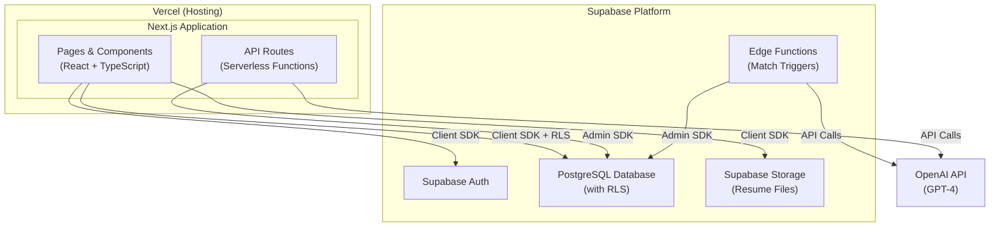

# Design Document: AI-Powered Job Matching Platform

## Overview

This document outlines the technical design for the AI-Powered Job Matching Platform. The system is split between two developers: Front-end/AI integration and Back-end/Database (Supabase). The architecture uses a Next.js frontend deployed on Vercel, Supabase for authentication, database, storage, and row-level security, and OpenAI for AI-powered matching and recommendations.

**Key Technology Decisions:**
- **Supabase** replaces the custom Express backend for auth, database, storage, and access control
- **Vercel + Next.js** replaces the separate React frontend and Express server
- **OpenAI** remains the AI provider for match calculation and recommendations
- **Next.js API Routes** handle server-side logic that can't run client-side (AI calls, complex business logic)

## Architecture

### High-Level Architecture



### Tech Stack

| Layer | Technology | Responsibility |
|-------|-----------|----------------|
| Frontend | Next.js (React) + TypeScript | UI components, routing, SSR/SSG, state management |
| Hosting | Vercel | Frontend deployment, serverless API routes, edge functions |
| Auth | Supabase Auth | User registration, login, session management, JWT |
| Database | Supabase (PostgreSQL) | User data, job descriptions, skills, matches, with RLS |
| Storage | Supabase Storage | Resume file storage (PDF/DOCX) |
| AI Service | OpenAI API (GPT-4) | Match calculation, recommendations, skill extraction |
| Access Control | Supabase RLS Policies | Role-based data access at the database level |
| Background Jobs | Supabase Edge Functions | Async match recalculation triggers |

### Developer Responsibilities

| Developer | Scope |
|-----------|-------|
| Dev 1 (Front-end/AI) | Next.js pages & components, API route handlers for AI integration, OpenAI prompt engineering, Match_Engine logic, Recommendation_Engine logic |
| Dev 2 (Back-end/Database) | Supabase schema & migrations, RLS policies, Edge Functions, Storage bucket configuration, database triggers for match recalculation |

## Components and Interfaces

### Frontend Structure (Next.js App Router)

```
src/
├── app/
│   ├── layout.tsx
│   ├── page.tsx                    (Landing/redirect)
│   ├── (auth)/
│   │   ├── login/page.tsx
│   │   └── register/page.tsx
│   ├── (dashboard)/
│   │   ├── applicant/
│   │   │   ├── page.tsx            (Applicant Dashboard)
│   │   │   ├── profile/page.tsx    (Skill Profile)
│   │   │   ├── jobs/page.tsx       (Job Listings)
│   │   │   └── jobs/[id]/page.tsx  (Job Detail + Recommendations)
│   │   └── hr/
│   │       ├── page.tsx            (HR Dashboard)
│   │       ├── jobs/new/page.tsx   (Create Job)
│   │       ├── jobs/[id]/edit/page.tsx (Edit Job)
│   │       └── jobs/[id]/rankings/page.tsx (Applicant Rankings)
│   └── api/
│       ├── match/
│       │   └── calculate/route.ts   (Match calculation endpoint)
│       ├── recommendations/
│       │   └── generate/route.ts    (Recommendation generation)
│       └── resume/
│           └── parse/route.ts       (Resume parsing with AI)
├── components/
│   ├── auth/
│   │   ├── LoginForm.tsx
│   │   ├── RegisterForm.tsx
│   │   └── RoleSelector.tsx
│   ├── applicant/
│   │   ├── SkillProfile.tsx
│   │   ├── ResumeUpload.tsx
│   │   ├── JobListings.tsx
│   │   ├── JobDetail.tsx
│   │   ├── MatchPercentageBadge.tsx
│   │   └── RecommendationsList.tsx
│   ├── hr/
│   │   ├── JobDescriptionForm.tsx
│   │   ├── JobDescriptionList.tsx
│   │   └── ApplicantRankings.tsx
│   └── shared/
│       ├── Navigation.tsx
│       ├── ProtectedRoute.tsx
│       └── LoadingSpinner.tsx
├── lib/
│   ├── supabase/
│   │   ├── client.ts              (Browser client)
│   │   ├── server.ts             (Server-side client for API routes)
│   │   └── middleware.ts          (Auth middleware for Next.js)
│   ├── ai/
│   │   ├── match-engine.ts
│   │   ├── recommendation-engine.ts
│   │   └── prompts.ts
│   └── validators/
│       ├── auth.ts
│       └── job.ts
├── hooks/
│   ├── useAuth.ts
│   ├── useProfile.ts
│   └── useMatchData.ts
├── types/
│   └── index.ts
└── middleware.ts                   (Next.js middleware for auth redirect)
```

### Supabase Configuration (Dev 2)

```
supabase/
├── migrations/
│   ├── 001_create_profiles.sql
│   ├── 002_create_skill_profiles.sql
│   ├── 003_create_jobs.sql
│   ├── 004_create_matches.sql
│   └── 005_create_recommendations.sql
├── functions/
│   ├── calculate-matches/index.ts    (Edge Function for async match calc)
│   └── recalculate-on-update/index.ts (Edge Function triggered on profile/job update)
├── seed.sql
└── config.toml
```

## Data Models

### Database Schema (Supabase PostgreSQL)

```sql
-- Extends Supabase auth.users with a public profiles table
CREATE TABLE public.profiles (
  id UUID PRIMARY KEY REFERENCES auth.users(id) ON DELETE CASCADE,
  email TEXT NOT NULL,
  name TEXT NOT NULL,
  role TEXT NOT NULL CHECK (role IN ('applicant', 'hr_user')),
  failed_login_attempts INTEGER DEFAULT 0,
  locked_until TIMESTAMPTZ,
  created_at TIMESTAMPTZ DEFAULT NOW(),
  updated_at TIMESTAMPTZ DEFAULT NOW()
);

-- Skill profiles for applicants
CREATE TABLE public.skill_profiles (
  id UUID PRIMARY KEY DEFAULT gen_random_uuid(),
  user_id UUID NOT NULL REFERENCES public.profiles(id) ON DELETE CASCADE,
  resume_file_path TEXT,
  raw_resume_text TEXT,
  created_at TIMESTAMPTZ DEFAULT NOW(),
  updated_at TIMESTAMPTZ DEFAULT NOW(),
  UNIQUE(user_id)
);

-- Individual skills linked to a profile
CREATE TABLE public.skills (
  id UUID PRIMARY KEY DEFAULT gen_random_uuid(),
  skill_profile_id UUID NOT NULL REFERENCES public.skill_profiles(id) ON DELETE CASCADE,
  name TEXT NOT NULL,
  proficiency_level TEXT CHECK (proficiency_level IN ('beginner', 'intermediate', 'advanced', 'expert')),
  source TEXT NOT NULL CHECK (source IN ('resume_parsed', 'manual')),
  created_at TIMESTAMPTZ DEFAULT NOW()
);

-- Job descriptions posted by HR users
CREATE TABLE public.job_descriptions (
  id UUID PRIMARY KEY DEFAULT gen_random_uuid(),
  hr_user_id UUID NOT NULL REFERENCES public.profiles(id) ON DELETE CASCADE,
  title TEXT NOT NULL,
  description TEXT NOT NULL,
  qualifications TEXT,
  status TEXT DEFAULT 'published' CHECK (status IN ('draft', 'published', 'closed')),
  created_at TIMESTAMPTZ DEFAULT NOW(),
  updated_at TIMESTAMPTZ DEFAULT NOW()
);

-- Required/preferred skills for a job description
CREATE TABLE public.job_required_skills (
  id UUID PRIMARY KEY DEFAULT gen_random_uuid(),
  job_description_id UUID NOT NULL REFERENCES public.job_descriptions(id) ON DELETE CASCADE,
  skill_name TEXT NOT NULL,
  importance TEXT DEFAULT 'required' CHECK (importance IN ('required', 'preferred')),
  created_at TIMESTAMPTZ DEFAULT NOW()
);

-- Match results (per applicant per job)
CREATE TABLE public.match_results (
  id UUID PRIMARY KEY DEFAULT gen_random_uuid(),
  applicant_id UUID NOT NULL REFERENCES public.profiles(id) ON DELETE CASCADE,
  job_description_id UUID NOT NULL REFERENCES public.job_descriptions(id) ON DELETE CASCADE,
  match_percentage INTEGER NOT NULL CHECK (match_percentage >= 0 AND match_percentage <= 100),
  matched_skills JSONB DEFAULT '[]',
  missing_skills JSONB DEFAULT '[]',
  calculated_at TIMESTAMPTZ DEFAULT NOW(),
  UNIQUE(applicant_id, job_description_id)
);

-- AI recommendations (per applicant per job)
CREATE TABLE public.recommendations (
  id UUID PRIMARY KEY DEFAULT gen_random_uuid(),
  applicant_id UUID NOT NULL REFERENCES public.profiles(id) ON DELETE CASCADE,
  job_description_id UUID NOT NULL REFERENCES public.job_descriptions(id) ON DELETE CASCADE,
  suggestion_type TEXT NOT NULL CHECK (suggestion_type IN ('skill_to_add', 'skill_to_improve')),
  skill_name TEXT NOT NULL,
  description TEXT NOT NULL,
  impact_score INTEGER CHECK (impact_score >= 1 AND impact_score <= 10),
  created_at TIMESTAMPTZ DEFAULT NOW()
);

-- Database trigger for match recalculation on skill profile update
CREATE OR REPLACE FUNCTION notify_profile_updated()
RETURNS TRIGGER AS $$
BEGIN
  PERFORM pg_notify('profile_updated', json_build_object('user_id', NEW.user_id)::text);
  RETURN NEW;
END;
$$ LANGUAGE plpgsql;

CREATE TRIGGER on_skill_profile_updated
  AFTER UPDATE ON public.skill_profiles
  FOR EACH ROW EXECUTE FUNCTION notify_profile_updated();

CREATE TRIGGER on_skill_added
  AFTER INSERT ON public.skills
  FOR EACH ROW EXECUTE FUNCTION notify_profile_updated();

CREATE TRIGGER on_skill_removed
  AFTER DELETE ON public.skills
  FOR EACH ROW EXECUTE FUNCTION notify_profile_updated();

-- Database trigger for match recalculation on job description update
CREATE OR REPLACE FUNCTION notify_job_updated()
RETURNS TRIGGER AS $$
BEGIN
  PERFORM pg_notify('job_updated', json_build_object('job_id', NEW.id)::text);
  RETURN NEW;
END;
$$ LANGUAGE plpgsql;

CREATE TRIGGER on_job_description_updated
  AFTER INSERT OR UPDATE ON public.job_descriptions
  FOR EACH ROW EXECUTE FUNCTION notify_job_updated();
```

### Row Level Security (RLS) Policies

```sql
-- Enable RLS on all tables
ALTER TABLE public.profiles ENABLE ROW LEVEL SECURITY;
ALTER TABLE public.skill_profiles ENABLE ROW LEVEL SECURITY;
ALTER TABLE public.skills ENABLE ROW LEVEL SECURITY;
ALTER TABLE public.job_descriptions ENABLE ROW LEVEL SECURITY;
ALTER TABLE public.job_required_skills ENABLE ROW LEVEL SECURITY;
ALTER TABLE public.match_results ENABLE ROW LEVEL SECURITY;
ALTER TABLE public.recommendations ENABLE ROW LEVEL SECURITY;

-- Profiles: users can read their own profile, HR can see applicant names for rankings
CREATE POLICY "Users can view own profile"
  ON public.profiles FOR SELECT
  USING (auth.uid() = id);

CREATE POLICY "HR users can view applicant names"
  ON public.profiles FOR SELECT
  USING (
    EXISTS (
      SELECT 1 FROM public.profiles p
      WHERE p.id = auth.uid() AND p.role = 'hr_user'
    )
    AND role = 'applicant'
  );

-- Skill profiles: only the owner can CRUD
CREATE POLICY "Applicants manage own skill profile"
  ON public.skill_profiles FOR ALL
  USING (user_id = auth.uid());

-- Skills: only the profile owner can CRUD
CREATE POLICY "Applicants manage own skills"
  ON public.skills FOR ALL
  USING (
    skill_profile_id IN (
      SELECT id FROM public.skill_profiles WHERE user_id = auth.uid()
    )
  );

-- Job descriptions: HR users manage their own, applicants can read published
CREATE POLICY "HR users manage own jobs"
  ON public.job_descriptions FOR ALL
  USING (hr_user_id = auth.uid());

CREATE POLICY "Applicants can view published jobs"
  ON public.job_descriptions FOR SELECT
  USING (status = 'published');

-- Job required skills: HR users manage via job ownership, applicants can read
CREATE POLICY "HR users manage job skills"
  ON public.job_required_skills FOR ALL
  USING (
    job_description_id IN (
      SELECT id FROM public.job_descriptions WHERE hr_user_id = auth.uid()
    )
  );

CREATE POLICY "Applicants can view job skills"
  ON public.job_required_skills FOR SELECT
  USING (
    job_description_id IN (
      SELECT id FROM public.job_descriptions WHERE status = 'published'
    )
  );

-- Match results: applicants see their own, HR sees matches for their jobs
CREATE POLICY "Applicants view own matches"
  ON public.match_results FOR SELECT
  USING (applicant_id = auth.uid());

CREATE POLICY "HR views matches for own jobs"
  ON public.match_results FOR SELECT
  USING (
    job_description_id IN (
      SELECT id FROM public.job_descriptions WHERE hr_user_id = auth.uid()
    )
  );

-- Recommendations: only the applicant can see their own
CREATE POLICY "Applicants view own recommendations"
  ON public.recommendations FOR SELECT
  USING (applicant_id = auth.uid());
```

### Supabase Storage Configuration

```sql
-- Create storage bucket for resumes
INSERT INTO storage.buckets (id, name, public, file_size_limit, allowed_mime_types)
VALUES (
  'resumes',
  'resumes',
  false,
  5242880, -- 5MB limit
  ARRAY['application/pdf', 'application/vnd.openxmlformats-officedocument.wordprocessingml.document']
);

-- Storage RLS: applicants can upload/read their own resumes
CREATE POLICY "Applicants upload own resumes"
  ON storage.objects FOR INSERT
  WITH CHECK (
    bucket_id = 'resumes'
    AND (storage.foldername(name))[1] = auth.uid()::text
  );

CREATE POLICY "Applicants read own resumes"
  ON storage.objects FOR SELECT
  USING (
    bucket_id = 'resumes'
    AND (storage.foldername(name))[1] = auth.uid()::text
  );
```

## API Design (Next.js API Routes)

### Authentication

Authentication is handled entirely by Supabase Auth client SDK. No custom API routes needed.

| Action | Method | Implementation |
|--------|--------|----------------|
| Register | Client-side | `supabase.auth.signUp({ email, password, options: { data: { role, name } } })` |
| Login | Client-side | `supabase.auth.signInWithPassword({ email, password })` |
| Logout | Client-side | `supabase.auth.signOut()` |
| Session refresh | Automatic | Supabase SDK handles token refresh |

### Next.js API Routes (Serverless Functions on Vercel)

| Method | Path | Description |
|--------|------|-------------|
| POST | /api/match/calculate | Trigger match calculation for a job or profile update |
| POST | /api/recommendations/generate | Generate AI recommendations for an applicant-job pair |
| POST | /api/resume/parse | Parse uploaded resume with OpenAI and extract skills |

### Direct Supabase Client Operations (via RLS)

| Operation | Table | Access Pattern |
|-----------|-------|----------------|
| Get/update own profile | profiles | Client SDK + RLS (own row) |
| CRUD skill profile | skill_profiles | Client SDK + RLS (own row) |
| Add/remove skills | skills | Client SDK + RLS (own profile's skills) |
| Browse published jobs | job_descriptions | Client SDK + RLS (published only for applicants) |
| CRUD own jobs (HR) | job_descriptions | Client SDK + RLS (own rows) |
| View own matches | match_results | Client SDK + RLS (own matches) |
| View rankings (HR) | match_results | Client SDK + RLS (matches for own jobs) |
| View own recommendations | recommendations | Client SDK + RLS (own recommendations) |

### Supabase Edge Functions

| Function | Trigger | Description |
|----------|---------|-------------|
| calculate-matches | Database webhook on job/profile update | Recalculates match percentages asynchronously |
| recalculate-on-update | pg_notify listener | Processes match recalculation queue within 30 seconds |

## AI Integration Design

### Match Engine

The Match_Engine calculates match percentages by:

1. Extracting required and preferred skills from the Job_Description
2. Comparing against the Applicant's Skill_Profile
3. Applying weighted scoring: required skills = 2x weight, preferred = 1x weight
4. Using OpenAI for fuzzy/semantic skill matching (e.g., "React" matches "React.js")
5. Producing a normalized score from 0-100

```typescript
// lib/ai/match-engine.ts
interface MatchResult {
  matchPercentage: number;
  matchedSkills: string[];
  missingSkills: string[];
}

async function calculateMatch(
  skillProfile: SkillProfile,
  jobDescription: JobDescription
): Promise<MatchResult> {
  // 1. Get required skills (weight 2) and preferred skills (weight 1)
  // 2. Use OpenAI to perform semantic skill matching
  // 3. Calculate weighted score
  // 4. Clamp and return normalized percentage (0-100)
}
```

### Recommendation Engine

The Recommendation_Engine generates suggestions by:

1. Identifying the gap between Skill_Profile and Job_Description requirements
2. Categorizing gaps as "Skill to Add" or "Skill to Improve"
3. Scoring each suggestion by potential impact on match percentage (1-10)
4. Ordering by impact score (highest first)

```typescript
// lib/ai/recommendation-engine.ts
interface Recommendation {
  type: 'skill_to_add' | 'skill_to_improve';
  skillName: string;
  description: string;
  impactScore: number; // 1-10
}

async function generateRecommendations(
  skillProfile: SkillProfile,
  jobDescription: JobDescription,
  matchResult: MatchResult
): Promise<Recommendation[]> {
  // Use OpenAI to analyze gap and produce actionable suggestions
  // Sort by impactScore descending
}
```

### Resume Parser

```typescript
// Called from /api/resume/parse API route
async function parseResume(fileContent: string): Promise<ExtractedSkills> {
  // Use OpenAI to extract structured skills from resume text
  // Returns array of { name, proficiencyLevel } objects
}
```

## Authentication Flow

1. User registers via Supabase Auth → `supabase.auth.signUp()` with role in `user_metadata`
2. A database trigger (or Supabase Auth hook) creates a corresponding `profiles` row
3. User logs in → Supabase Auth issues JWT with user metadata
4. Next.js middleware checks session on protected routes using `supabase.auth.getSession()`
5. Role-based routing: middleware redirects to role-appropriate dashboard
6. RLS policies enforce data access at the database level using `auth.uid()`
7. Session auto-refreshes via Supabase SDK; expires after 60 minutes of inactivity (configured in Supabase Auth settings)

### Account Lockout Logic

Since Supabase Auth doesn't natively support account lockout after N failed attempts, this is implemented via:
1. A `failed_login_attempts` counter in the `profiles` table
2. A `locked_until` timestamp field
3. A Next.js API route wrapper or Supabase Edge Function that checks/increments on failed login
4. After 5 consecutive failures, `locked_until` is set to `NOW() + 15 minutes`

## Data Flow: Match Calculation Trigger

Match recalculation is triggered when:
- A new Job_Description is published → calculate for all applicants
- An Applicant updates their Skill_Profile → recalculate for all jobs
- An HR_User edits a Job_Description → recalculate for all applicants on that job

**Flow:**
1. Database trigger fires `pg_notify` on insert/update
2. Supabase Edge Function listens for the notification
3. Edge Function calls the match calculation logic (uses OpenAI via API)
4. Results are written to `match_results` table using Supabase admin client
5. Entire process completes within 30 seconds

## Correctness Properties

*A property is a characteristic or behavior that should hold true across all valid executions of a system — essentially, a formal statement about what the system should do. Properties serve as the bridge between human-readable specifications and machine-verifiable correctness guarantees.*

### Property 1: Match Percentage Range Invariant

*For any* Applicant Skill_Profile and any Job_Description, the calculated Match_Percentage SHALL always be an integer between 0 and 100 inclusive.

**Validates: Requirements 5.2**

### Property 2: Ranking Order Property

*For any* Ranking_List for a Job_Description, each entry's Match_Percentage SHALL be greater than or equal to the next entry's Match_Percentage (descending order).

**Validates: Requirements 6.1, 5.5**

### Property 3: Recommendation Completeness

*For any* Applicant-Job_Description pair where Match_Percentage is less than 100, the Recommendation_Engine SHALL produce at least one suggestion.

**Validates: Requirements 7.4**

### Property 4: Skill Profile Round-Trip Consistency

*For any* skill added to a Skill_Profile, immediately retrieving the profile SHALL include that skill with its original name and attributes.

**Validates: Requirements 3.2**

### Property 5: Match Symmetry Across Views

*For any* Applicant-Job_Description pair, the Match_Percentage SHALL be identical whether accessed from the Applicant's job listing view or the HR_User's ranking view.

**Validates: Requirements 5.4, 6.2**

### Property 6: Recalculation Idempotence

*For any* unchanged Skill_Profile and Job_Description pair, running match calculation multiple times SHALL produce the same Match_Percentage.

**Validates: Requirements 5.2, 5.3**

### Property 7: Required Skills Weight Dominance

*For any* Applicant who matches a single skill, that skill being marked as "required" on a Job_Description SHALL contribute more to the Match_Percentage than if the same skill were marked as "preferred".

**Validates: Requirements 5.3**

### Property 8: Job Deletion Cascade

*For any* Job_Description that is deleted, all associated match_results and recommendations for that Job_Description SHALL be removed from the database.

**Validates: Requirements 4.4**

### Property 9: Tie-Handling in Rankings

*For any* two Applicants with the same Match_Percentage for a Job_Description, they SHALL be assigned the same rank and sorted alphabetically by name.

**Validates: Requirements 6.3**

### Property 10: Password Validation

*For any* string submitted as a password, the validation function SHALL accept it if and only if it contains at least 8 characters with at least one uppercase letter, one lowercase letter, and one number.

**Validates: Requirements 1.3**

### Property 11: Job Description Requires At Least One Skill

*For any* Job_Description submission, it SHALL be rejected if it contains zero required skills.

**Validates: Requirements 4.2**

### Property 12: Search Filter Correctness

*For any* search filter applied to job listings, all returned results SHALL match the filter criteria (keyword, skills, or match percentage range).

**Validates: Requirements 9.2**

## Error Handling

| Scenario | Handling Strategy |
|----------|-------------------|
| Supabase Auth failure | Display user-friendly error, log details server-side |
| Resume upload exceeds 5MB | Client-side validation + Supabase Storage bucket limit enforcement |
| Invalid file type (not PDF/DOCX) | Client-side validation + Storage bucket allowed_mime_types |
| Resume parsing failure (AI) | Return error to user, suggest manual skill entry |
| OpenAI API rate limit/failure | Retry with exponential backoff (3 attempts), then queue for later |
| Match calculation timeout (>30s) | Log warning, serve stale results, retry in background |
| RLS policy violation | Supabase returns empty result set (no error exposed to client) |
| Network failure | Client-side retry with toast notification |
| Session expired | Next.js middleware redirects to login page |
| Account locked | Display lockout message with remaining time |

## Testing Strategy

### Testing Approach

- **Unit tests**: Verify specific examples, edge cases, and error conditions
- **Property-based tests**: Verify universal properties across all inputs using generated data
- **Integration tests**: Verify end-to-end flows including Supabase interactions

### Property-Based Testing

The following correctness properties will be tested using a property-based testing library (e.g., `fast-check` for TypeScript):

- Each property test runs a minimum of 100 iterations
- Each test is tagged with its design document property reference
- Tag format: **Feature: ai-job-matching-platform, Property {number}: {property_text}**

**Properties suitable for PBT:**
1. Match Percentage Range Invariant (Property 1)
2. Ranking Order Property (Property 2)
3. Recommendation Completeness (Property 3)
4. Skill Profile Round-Trip Consistency (Property 4)
5. Recalculation Idempotence (Property 6)
6. Required Skills Weight Dominance (Property 7)
7. Tie-Handling in Rankings (Property 9)
8. Password Validation (Property 10)
9. Job Description Requires At Least One Skill (Property 11)
10. Search Filter Correctness (Property 12)

### Unit Tests

- Login error message is generic (doesn't reveal which field is wrong)
- Account lockout after 5 failed attempts
- Session expiry redirect behavior
- Job detail page displays all required fields
- Empty search results show appropriate message
- 100% match shows "fully matched" message

### Integration Tests

- Full registration → login → profile creation flow via Supabase Auth
- Resume upload → AI parsing → skill profile creation pipeline
- Job creation → match calculation trigger → results available within 30s
- Profile update → match recalculation → ranking update pipeline
- RLS policy enforcement (applicants can't see other applicants' data)

### Test Infrastructure

| Tool | Purpose |
|------|---------|
| Vitest | Unit and property test runner |
| fast-check | Property-based test generation |
| Supabase CLI | Local Supabase instance for integration tests |
| Testing Library | React component testing |
| Playwright | End-to-end browser testing |
