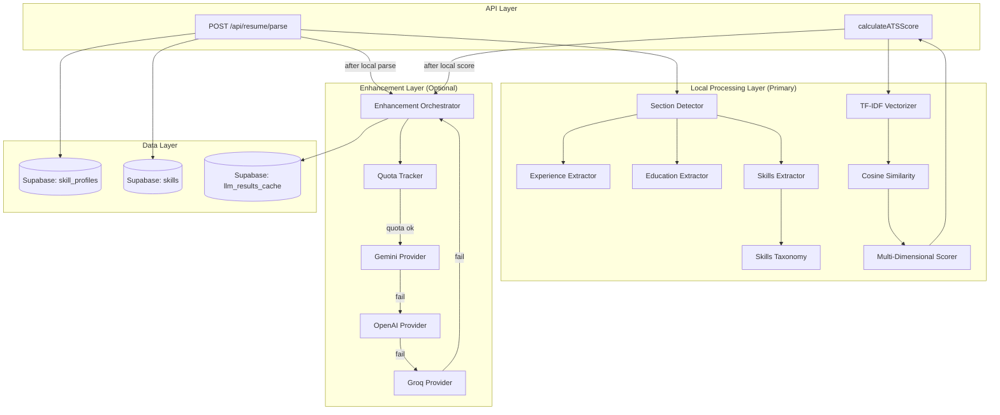
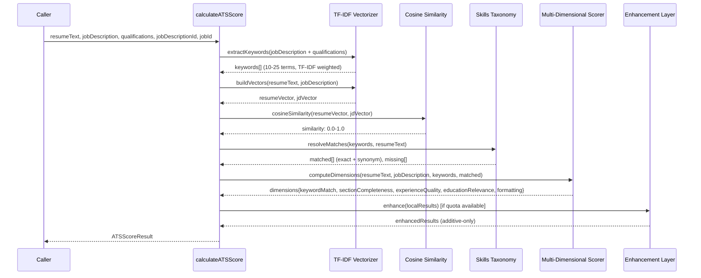
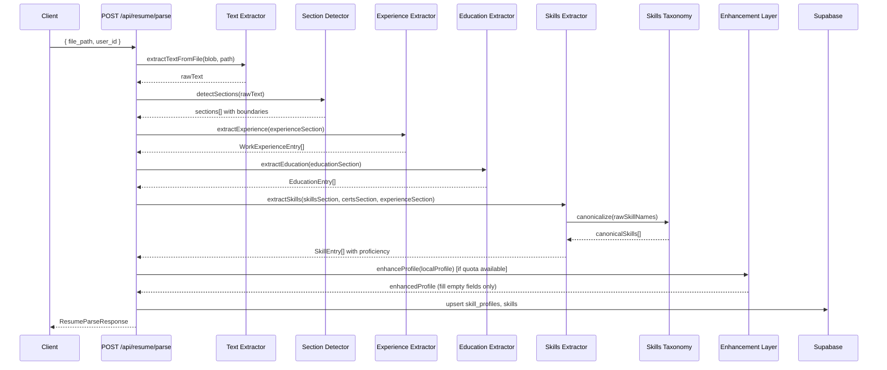

# Design Document: Hybrid ATS Resume Parser

## Overview

This feature refactors the CareerFlow ATS scoring pipeline and resume parsing endpoint from an AI-primary architecture to a local-first architecture with optional AI enhancement. The current system uses LLM calls as the primary method for keyword extraction, resume matching, and profile parsing — with weak regex/exact-match fallbacks. The refactored system inverts this: production-quality local algorithms (TF-IDF vectorization, cosine similarity, header-based section detection) serve as the primary processing layer, while AI APIs (Gemini → OpenAI → Groq) act as an optional enhancement layer that enriches results when quota is available.

The design introduces eight new modules and refactors five existing ones while maintaining full backward compatibility with existing function signatures and response shapes. All local processing targets <500ms for 10,000-word documents. No new npm dependencies are required for NLP — TF-IDF is implemented from scratch as pure math over token arrays.

## Architecture



## Data Flow Diagrams

### ATS Scoring Data Flow



### Resume Parsing Data Flow



## Components and Interfaces

### Component 1: TF-IDF Vectorizer (`src/lib/nlp/tfidf.ts`)

**Purpose**: Implements Term Frequency–Inverse Document Frequency computation and document vectorization over a two-document corpus (resume + job description). No external dependencies.

**Interface**:
```typescript
export interface TFIDFOptions {
  minTermLength: number;       // default: 2
  maxKeywords: number;         // default: 25
  minKeywords: number;         // default: 10
  preserveSpecialChars: string; // default: "#+.-/"
}

export interface DocumentVector {
  terms: string[];
  weights: Float64Array;
  termIndex: Map<string, number>;
}

export interface KeywordResult {
  term: string;
  weight: number;
  isMultiWord: boolean;
}

/** Tokenize and normalize text, removing stop words */
export function tokenize(text: string, preserveChars?: string): string[];

/** Compute TF-IDF weights for all terms in a document against a corpus */
export function computeTFIDF(document: string[], corpus: string[][]): Map<string, number>;

/** Extract top keywords from text by TF-IDF weight */
export function extractKeywords(text: string, options?: Partial<TFIDFOptions>): KeywordResult[];

/** Detect multi-word terms (bigrams/trigrams) via collocation analysis */
export function detectCollocations(tokens: string[], minFrequency?: number): string[];

/** Build a document vector from text using TF-IDF weights over a shared vocabulary */
export function buildVector(text: string, vocabulary: string[], idfWeights: Map<string, number>): DocumentVector;

/** Compute cosine similarity between two document vectors */
export function cosineSimilarity(vecA: DocumentVector, vecB: DocumentVector): number;
```

**Responsibilities**:
- Tokenization with configurable special character preservation
- Stop word removal (shared stop word set)
- Term frequency computation per document
- Inverse document frequency over two-document corpus
- Bigram/trigram collocation detection (min frequency threshold)
- Document vector construction
- Cosine similarity computation

### Component 2: Skills Taxonomy (`src/lib/nlp/skills-taxonomy.ts`)

**Purpose**: Static TypeScript data structure providing O(1) synonym resolution, abbreviation expansion, and skill categorization. Compiled into the application bundle — no runtime I/O.

**Interface**:
```typescript
export interface SkillEntry {
  canonical: string;
  synonyms: string[];
  category: SkillCategory;
  industries: IndustryId[];
}

export type SkillCategory =
  | 'Programming Languages'
  | 'Frameworks'
  | 'Cloud Platforms'
  | 'Databases'
  | 'DevOps'
  | 'Data Science'
  | 'Design'
  | 'Soft Skills'
  | 'Testing'
  | 'Security'
  | 'Mobile'
  | 'Other';

export type IndustryId =
  | 'software-engineering'
  | 'data-science'
  | 'devops'
  | 'finance'
  | 'healthcare'
  | 'cybersecurity'
  | 'mobile-development'
  | 'game-development';

/** Lookup a skill by any name (canonical or synonym). O(1) via pre-built Map. */
export function lookupSkill(name: string): SkillEntry | null;

/** Resolve a name to its canonical form. Returns original if not found. */
export function canonicalize(name: string): string;

/** Check if two skill names are synonyms of each other */
export function areSynonyms(nameA: string, nameB: string): boolean;

/** Get all skills in a category */
export function getByCategory(category: SkillCategory): SkillEntry[];

/** Get the full taxonomy size */
export function getTaxonomySize(): number;
```

**Responsibilities**:
- Store 200+ skill entries with synonyms, categories, and industries
- Pre-build a `Map<lowercaseName, SkillEntry>` at module load time for O(1) lookups
- Provide synonym resolution for both ATS matching and resume skill canonicalization
- Load in <50ms (guaranteed by being a static TypeScript constant compiled into bundle)

### Component 3: Section Detector (`src/lib/resume-parser/section-detector.ts`)

**Purpose**: Identifies logical section boundaries in resume text using header pattern recognition and layout analysis. Inspired by OpenResume's section detection approach.

**Interface**:
```typescript
export type SectionType =
  | 'header-contact'
  | 'experience'
  | 'education'
  | 'skills'
  | 'certifications'
  | 'projects'
  | 'achievements'
  | 'unstructured';

export interface DetectedSection {
  type: SectionType;
  startLine: number;
  endLine: number;
  headerLine: string;
  confidence: number; // 1-5 based on priority match
  lines: string[];
}

export interface SectionDetectionResult {
  sections: DetectedSection[];
  hasStructure: boolean;
}

/** Detect all sections in resume text */
export function detectSections(text: string): SectionDetectionResult;

/** Get lines belonging to a specific section type */
export function getSectionContent(result: SectionDetectionResult, type: SectionType): string[];
```

**Responsibilities**:
- Recognize 5 header pattern types with priority scoring
- Map header text to section types using keyword aliases (case-insensitive)
- Assign text between headers to the preceding section
- Handle pre-header text as "header-contact" section
- Handle no-header resumes as "unstructured" single section

### Component 4: Experience Extractor (`src/lib/resume-parser/experience-extractor.ts`)

**Purpose**: Extracts structured work experience entries from section content, detecting date ranges, job titles, organizations, and bullet point accomplishments.

**Interface**:
```typescript
export interface WorkExperienceEntry {
  title: string;
  company: string;
  startDate: string;
  endDate: string;
  isCurrent: boolean;
  highlights: string[];
}

/** Extract experience entries from section lines (max 20 entries) */
export function extractExperience(lines: string[]): WorkExperienceEntry[];
```

**Responsibilities**:
- Detect date patterns (multiple formats: "Jan 2022 - Present", "2020 - 2023", "March 2021 – December 2022")
- Separate title from organization using delimiters: " - ", " | ", " at ", comma + capitalized word
- Capture bullet points (•, -, *, numbered) with 200-char max
- Mark current positions via "Present" or "Current" keywords
- Cap at 20 entries, 20 bullets per entry

### Component 5: Education Extractor (`src/lib/resume-parser/education-extractor.ts`)

**Purpose**: Extracts structured education entries with degree, institution, field, and graduation year.

**Interface**:
```typescript
export interface EducationEntry {
  degree: string;
  institution: string;
  fieldOfStudy: string | null;
  graduationYear: string;
}

/** Extract education entries from section lines (max 20 entries) */
export function extractEducation(lines: string[]): EducationEntry[];
```

**Responsibilities**:
- Detect degree keywords (Bachelor, Master, Ph.D., B.S., M.S., etc.)
- Parse date ranges to extract graduation year (end year)
- Split degree/institution using delimiter-based parsing
- Handle missing fields gracefully (empty string, not undefined)
- Cap at 20 entries

### Component 6: Skills Extractor (`src/lib/resume-parser/skills-extractor.ts`)

**Purpose**: Extracts skills and certifications from resume sections, assigns proficiency levels using heuristic rules, and canonicalizes names via the skills taxonomy.

**Interface**:
```typescript
export interface ExtractedSkill {
  name: string;          // canonical name from taxonomy (or original if not found)
  rawName: string;       // original extracted text
  proficiencyLevel: 'beginner' | 'intermediate' | 'advanced';
  source: SectionType;   // which section it was found in
}

export interface CertificationEntry {
  name: string;
  issuer: string;
  date: string;
}

export interface SkillsExtractionInput {
  skillsLines: string[];
  certificationLines: string[];
  experienceLines: string[];
  projectLines: string[];
}

/** Extract skills with proficiency assignment (max 100 skills) */
export function extractSkills(input: SkillsExtractionInput): ExtractedSkill[];

/** Extract certifications (max 50 entries) */
export function extractCertifications(lines: string[]): CertificationEntry[];
```

**Responsibilities**:
- Parse comma-separated, pipe-separated, bullet-point, and categorized skill lists
- Assign proficiency: advanced (in experience/projects with quantified achievements), intermediate (skills section), beginner (certifications only)
- Promote proficiency when skill appears in multiple sections (highest wins)
- Canonicalize via skills taxonomy lookup
- Preserve rawName for audit trail
- Cap at 100 skills, 50 certifications

### Component 7: Resume Parser Orchestrator (`src/lib/resume-parser/index.ts`)

**Purpose**: Combines all extractors into a single parse pipeline. Coordinates section detection → per-section extraction → taxonomy canonicalization → optional AI enhancement.

**Interface**:
```typescript
export interface StructuredProfile {
  experience: WorkExperienceEntry[];
  education: EducationEntry[];
  skills: ExtractedSkill[];
  certifications: CertificationEntry[];
  projects: ProjectEntry[];
  achievements: string[];
}

export interface ProjectEntry {
  name: string;
  description: string;
  technologies: string[];
  outcome: string | null;
}

export interface ParseOptions {
  enableEnhancement?: boolean; // default: true
  enhancementTimeout?: number; // default: 10000ms
}

/** Parse resume text into structured profile */
export function parseResume(text: string, options?: ParseOptions): Promise<StructuredProfile>;

/** Parse resume text using local-only processing (no AI) */
export function parseResumeLocal(text: string): StructuredProfile;
```

**Responsibilities**:
- Orchestrate section detection → extraction → canonicalization pipeline
- Invoke enhancement layer if enabled and quota available
- Merge AI results additively (fill empty fields only, never overwrite)
- Ensure output is JSON-safe (no undefined, no Date objects, no circular refs)
- Guarantee round-trip consistency: `JSON.parse(JSON.stringify(profile))` === profile

### Component 8: Groq Provider (`src/lib/llm/groq-provider.ts`)

**Purpose**: Adapter for the Groq API (Llama 3.3 70B model) following the existing provider pattern. Third fallback in the enhancement chain.

**Interface**:
```typescript
import type { LLMRequest } from './types';

/** Call Groq API with Llama 3.3 70B. Throws LLMError on failure. */
export async function callGroq(request: LLMRequest): Promise<string>;
```

**Responsibilities**:
- Authenticate via `GROQ_API_KEY` environment variable
- Use OpenAI-compatible endpoint format (Groq API is OpenAI-compatible)
- Request JSON response format with low temperature
- Enforce 10-second timeout
- Throw typed LLMError on failure (rate_limit, auth_error, timeout, etc.)

### Component 9: Enhancement Orchestrator (within `src/lib/career-intelligence/ats-scorer.ts`)

**Purpose**: Manages the optional AI enhancement layer with quota tracking and provider chain orchestration.

**Interface**:
```typescript
export interface EnhancementResult {
  additionalMatches: ATSKeywordMatch[];
  refinedKeywords: string[];
  applied: boolean;
  provider: LLMProvider | null;
}

export interface QuotaState {
  suppressedUntil: number | null; // Unix timestamp (end of current calendar hour)
}

/** Check if enhancement is available (quota not suppressed) */
export function isEnhancementAvailable(): boolean;

/** Enhance local ATS results with AI (additive-only) */
export function enhanceATSResults(
  localResults: CachedATSAnalysis,
  resumeText: string,
  jobDescription: string,
  keywords: string[]
): Promise<EnhancementResult>;

/** Record quota exceeded for current calendar hour */
export function recordQuotaExceeded(): void;
```

## Data Models

### Extended ATSScoreResult (Backward Compatible)

```typescript
// src/lib/career-intelligence/types.ts — additions

export interface DimensionScores {
  keywordMatch: number;        // 0-100
  sectionCompleteness: number; // 0-100
  experienceQuality: number;   // 0-100
  educationRelevance: number;  // 0-100
  formatting: number;          // 0-100
}

export interface ATSScoreResult {
  score: number;                          // 0-100, composite weighted average
  totalKeywords: number;
  matchedKeywords: ATSKeywordMatch[];
  missingKeywords: string[];
  suggestions: ATSSuggestion[];
  analysisSource: 'llm' | 'local';
  dimensions?: DimensionScores;           // NEW: optional, omitted if not requested
}
```

### LLMProvider Union (Extended)

```typescript
// src/lib/llm/types.ts — modification
export type LLMProvider = 'openai' | 'gemini' | 'llm7' | 'groq';
```

### Resume Parser Response Types

```typescript
// Used by POST /api/resume/parse response
export interface ResumeParseResponse {
  success: boolean;
  skills: Array<{ name: string; proficiency_level: string }>;
  profile?: StructuredProfile;
  raw_text?: string;
  error?: string;
}
```

### Skills Taxonomy Data Structure

```typescript
// src/lib/nlp/skills-taxonomy.ts — internal structure

// The taxonomy is a frozen array of skill entries
const SKILLS_TAXONOMY: readonly SkillEntry[] = [
  {
    canonical: 'React',
    synonyms: ['ReactJS', 'React.js', 'react'],
    category: 'Frameworks',
    industries: ['software-engineering', 'mobile-development'],
  },
  {
    canonical: 'Amazon Web Services',
    synonyms: ['AWS', 'aws'],
    category: 'Cloud Platforms',
    industries: ['software-engineering', 'devops', 'data-science'],
  },
  // ... 200+ entries
] as const;

// Pre-built lookup map (populated at module load)
// Maps every synonym (lowercased) → its parent SkillEntry
const LOOKUP_MAP: Map<string, SkillEntry> = new Map();
```

## Algorithmic Pseudocode

### Algorithm 1: TF-IDF Keyword Extraction

```typescript
function extractKeywords(text: string, options: TFIDFOptions): KeywordResult[] {
  // PRECONDITIONS:
  //   text is a non-null string
  //   options.minKeywords <= options.maxKeywords
  // POSTCONDITIONS:
  //   returns KeywordResult[] with length in [0, maxKeywords]
  //   results are sorted by descending TF-IDF weight
  //   all returned terms have weight > 0

  // Step 1: Tokenize and normalize
  const tokens = tokenize(text, options.preserveSpecialChars);
  // tokens = lowercase, stop-words removed, special chars preserved

  if (tokens.length === 0) return [];

  // Step 2: Detect multi-word collocations (bigrams/trigrams)
  const collocations = detectCollocations(tokens, /* minFrequency */ 2);
  // Replace individual tokens with collocations where applicable

  // Step 3: Build two-document corpus: [jobDescription, syntheticBackground]
  // The "synthetic background" is a uniform-frequency document representing
  // general English, allowing IDF to penalize common words
  const corpus = [tokens, BACKGROUND_CORPUS_TOKENS];

  // Step 4: Compute TF-IDF for each term
  const tfidfWeights = computeTFIDF(tokens, corpus);
  // TF(t, d) = count(t in d) / |d|
  // IDF(t) = log(|corpus| / (1 + count(docs containing t)))
  // TF-IDF(t, d) = TF(t, d) * IDF(t)

  // Step 5: Sort by weight, take top maxKeywords
  const sorted = Array.from(tfidfWeights.entries())
    .sort((a, b) => b[1] - a[1])
    .slice(0, options.maxKeywords);

  // Step 6: Ensure minimum count (if enough candidates exist)
  const results = sorted.map(([term, weight]) => ({
    term,
    weight,
    isMultiWord: term.includes(' '),
  }));

  return results;
}
```

**Loop Invariants**:
- At each iteration of TF computation: `sum(frequencies) === tokens processed so far`
- During IDF computation: `documentFrequency[t] <= corpus.length` for all terms t
- Final output: `results.length <= maxKeywords` and all weights are positive

### Algorithm 2: Cosine Similarity Computation

```typescript
function cosineSimilarity(vecA: DocumentVector, vecB: DocumentVector): number {
  // PRECONDITIONS:
  //   vecA and vecB are built over the same vocabulary (same terms[] and termIndex)
  //   weights are Float64Array with same length as terms
  // POSTCONDITIONS:
  //   returns value in [0.0, 1.0]
  //   returns 0.0 if either vector has zero magnitude
  //   returns 1.0 if vectors are identical (angle = 0)

  let dotProduct = 0;
  let magnitudeA = 0;
  let magnitudeB = 0;

  // Single pass over shared vocabulary dimension
  for (let i = 0; i < vecA.weights.length; i++) {
    const a = vecA.weights[i];
    const b = vecB.weights[i];
    dotProduct += a * b;
    magnitudeA += a * a;
    magnitudeB += b * b;
  }

  magnitudeA = Math.sqrt(magnitudeA);
  magnitudeB = Math.sqrt(magnitudeB);

  // Guard against division by zero
  if (magnitudeA === 0 || magnitudeB === 0) return 0;

  const similarity = dotProduct / (magnitudeA * magnitudeB);

  // Clamp to [0, 1] to handle floating point imprecision
  return Math.max(0, Math.min(1, similarity));
}
```

**Formal Specification**:
- `cosineSimilarity(v, v) === 1.0` for any non-zero vector v (identity)
- `cosineSimilarity(v, w) === cosineSimilarity(w, v)` (symmetry)
- `cosineSimilarity(v, w) >= 0` for any vectors with non-negative components (non-negativity for TF-IDF)
- `cosineSimilarity(zero, any) === 0` (zero vector yields zero)

### Algorithm 3: Section Detection with Priority Scoring

```typescript
function detectSections(text: string): SectionDetectionResult {
  // PRECONDITIONS:
  //   text is a non-null string (may be empty)
  // POSTCONDITIONS:
  //   if no headers detected: returns single "unstructured" section
  //   sections cover all lines (no gaps)
  //   sections are non-overlapping and ordered by startLine
  //   pre-header text is assigned to "header-contact"

  const lines = text.split('\n');
  const candidates: HeaderCandidate[] = [];

  for (let i = 0; i < lines.length; i++) {
    const line = lines[i].trim();
    const prevLine = i > 0 ? lines[i - 1].trim() : '';
    const nextLine = i < lines.length - 1 ? lines[i + 1].trim() : '';

    // Priority 1: UPPERCASE + underline on next line
    if (isUppercase(line) && isUnderline(nextLine)) {
      candidates.push({ lineIndex: i, priority: 1, text: line });
    }
    // Priority 2: UPPERCASE standalone (not embedded in sentence)
    else if (isUppercase(line) && isStandalone(line) && line.length < 50) {
      candidates.push({ lineIndex: i, priority: 2, text: line });
    }
    // Priority 3: Title-case + preceded by blank line
    else if (isTitleCase(line) && prevLine === '' && isStandalone(line)) {
      candidates.push({ lineIndex: i, priority: 3, text: line });
    }
    // Priority 4: Title-case + followed by colon
    else if (isTitleCase(line) && line.endsWith(':')) {
      candidates.push({ lineIndex: i, priority: 4, text: line.slice(0, -1) });
    }
    // Priority 5: Inline text containing section keyword
    else if (containsSectionKeyword(line) && line.length < 40) {
      candidates.push({ lineIndex: i, priority: 5, text: line });
    }
  }

  // Resolve conflicts: when multiple candidates map to same section type,
  // keep the one with highest priority (lowest number)
  const resolvedHeaders = resolveConflicts(candidates);

  if (resolvedHeaders.length === 0) {
    return {
      sections: [{ type: 'unstructured', startLine: 0, endLine: lines.length - 1,
                   headerLine: '', confidence: 0, lines }],
      hasStructure: false,
    };
  }

  // Build sections from resolved headers
  return buildSections(lines, resolvedHeaders);
}
```

**Section Type Keyword Aliases** (case-insensitive matching):
| Section Type | Keywords |
|---|---|
| experience | "experience", "work experience", "employment", "internships", "leadership" |
| education | "education", "academic background", "qualifications" |
| skills | "skills", "technical skills", "core competencies", "programming" |
| certifications | "certifications", "certificates", "training", "seminars" |
| projects | "projects", "portfolio", "personal projects" |
| achievements | "achievements", "awards", "honors" |

### Algorithm 4: Multi-Dimensional ATS Scoring

```typescript
function computeDimensions(
  resumeText: string,
  jobDescription: string,
  keywords: string[],
  matchedKeywords: ATSKeywordMatch[],
  sections: SectionDetectionResult
): DimensionScores {
  // PRECONDITIONS:
  //   resumeText and jobDescription are non-empty strings
  //   keywords.length > 0
  //   sections is a valid SectionDetectionResult
  // POSTCONDITIONS:
  //   all dimension scores are integers in [0, 100]
  //   composite = round(KM*0.4 + SC*0.15 + EQ*0.2 + ER*0.15 + F*0.1)

  // Dimension 1: Keyword Match (40% weight)
  // Already computed as cosine similarity percentage
  const keywordMatch = Math.round(
    cosineSimilarity(buildVector(resumeText), buildVector(jobDescription)) * 100
  );

  // Dimension 2: Section Completeness (15% weight)
  // 5 expected sections, each worth 20 points
  const expectedSections: SectionType[] = ['experience', 'education', 'skills', 'projects', 'certifications'];
  const detectedTypes = new Set(sections.sections.map(s => s.type));
  const sectionCompleteness = expectedSections.filter(s => detectedTypes.has(s)).length * 20;

  // Dimension 3: Experience Quality (20% weight)
  // 50% quantified achievements + 30% action verbs + 20% recency
  const expSection = getSectionContent(sections, 'experience');
  const bullets = extractBulletPoints(expSection);
  const quantifiedRatio = bullets.filter(hasQuantification).length / Math.max(bullets.length, 1);
  const actionVerbRatio = bullets.filter(startsWithActionVerb).length / Math.max(bullets.length, 1);
  const recencyScore = computeRecencyScore(expSection); // 100 if <2yr, 50 if 2-5yr, 0 if >5yr
  const experienceQuality = Math.round(
    quantifiedRatio * 100 * 0.5 +
    actionVerbRatio * 100 * 0.3 +
    recencyScore * 0.2
  );

  // Dimension 4: Education Relevance (15% weight)
  // Compare degree field to job domain keywords
  const educationRelevance = computeEducationRelevance(sections, jobDescription);
  // exact/synonym match = 100, partial (same broad category) = 60, no match = 20

  // Dimension 5: Formatting (10% weight)
  // Start at 100, deduct 20 for each issue (min 0)
  let formatting = 100;
  if (hasImagePlaceholders(resumeText)) formatting -= 20;
  if (hasHTMLTables(resumeText)) formatting -= 20;
  if (countSectionHeaders(sections) < 3) formatting -= 20;
  if (percentLongLines(resumeText) > 0.3) formatting -= 20;
  if (resumeText.length < 200) formatting -= 20;
  formatting = Math.max(0, formatting);

  return {
    keywordMatch: clamp(keywordMatch, 0, 100),
    sectionCompleteness: clamp(sectionCompleteness, 0, 100),
    experienceQuality: clamp(experienceQuality, 0, 100),
    educationRelevance: clamp(educationRelevance, 0, 100),
    formatting: clamp(formatting, 0, 100),
  };
}

function computeCompositeScore(dimensions: DimensionScores): number {
  // Weighted average with fixed weights
  const composite =
    dimensions.keywordMatch * 0.4 +
    dimensions.sectionCompleteness * 0.15 +
    dimensions.experienceQuality * 0.2 +
    dimensions.educationRelevance * 0.15 +
    dimensions.formatting * 0.1;
  return clamp(Math.round(composite), 0, 100);
}
```

**Loop Invariants**:
- `formatting` decreases monotonically (only deductions, never additions)
- `quantifiedRatio` and `actionVerbRatio` are always in [0, 1]
- Composite score is always in [0, 100] due to all inputs being [0, 100] and weights summing to 1.0

### Algorithm 5: Skills Taxonomy O(1) Lookup

```typescript
// Module-level initialization (runs once at import time)
const LOOKUP_MAP = new Map<string, SkillEntry>();

// Pre-populate: O(n * m) where n = entries, m = avg synonyms per entry
// Runs once at application startup, <50ms for 200+ entries
for (const entry of SKILLS_TAXONOMY) {
  LOOKUP_MAP.set(entry.canonical.toLowerCase(), entry);
  for (const synonym of entry.synonyms) {
    LOOKUP_MAP.set(synonym.toLowerCase(), entry);
  }
}

function lookupSkill(name: string): SkillEntry | null {
  // PRECONDITIONS: name is a non-empty string
  // POSTCONDITIONS: returns SkillEntry if name matches any canonical or synonym, null otherwise
  // TIME COMPLEXITY: O(1) average (hash map lookup)
  return LOOKUP_MAP.get(name.toLowerCase()) ?? null;
}

function areSynonyms(nameA: string, nameB: string): boolean {
  // PRECONDITIONS: nameA and nameB are non-empty strings
  // POSTCONDITIONS: returns true iff both resolve to the same canonical entry
  const entryA = lookupSkill(nameA);
  const entryB = lookupSkill(nameB);
  if (!entryA || !entryB) return false;
  return entryA.canonical === entryB.canonical;
}

function canonicalize(name: string): string {
  // Returns canonical name if found in taxonomy, otherwise returns input unchanged
  const entry = lookupSkill(name);
  return entry ? entry.canonical : name;
}
```

### Algorithm 6: Enhancement Layer Merge Logic (Additive-Only)

```typescript
function mergeEnhancement(
  localResults: CachedATSAnalysis,
  aiResults: Partial<CachedATSAnalysis>
): CachedATSAnalysis {
  // PRECONDITIONS:
  //   localResults is a complete, valid CachedATSAnalysis
  //   aiResults may contain additional matches not in localResults
  // POSTCONDITIONS:
  //   result.matchedKeywords is a SUPERSET of localResults.matchedKeywords
  //   result.missingKeywords is a SUBSET of localResults.missingKeywords
  //   no local match is ever removed or downgraded
  //   result.analysisSource = 'llm' if any AI matches were added, else 'local'

  const merged = { ...localResults };
  const existingMatches = new Set(
    localResults.matchedKeywords.map(m => m.keyword.toLowerCase())
  );

  let aiMatchesAdded = 0;

  // Add AI-detected matches that local processing missed
  if (aiResults.matchedKeywords) {
    for (const aiMatch of aiResults.matchedKeywords) {
      if (!existingMatches.has(aiMatch.keyword.toLowerCase())) {
        merged.matchedKeywords.push(aiMatch);
        existingMatches.add(aiMatch.keyword.toLowerCase());
        aiMatchesAdded++;

        // Remove from missingKeywords
        merged.missingKeywords = merged.missingKeywords.filter(
          k => k.toLowerCase() !== aiMatch.keyword.toLowerCase()
        );
      }
    }
  }

  merged.analysisSource = aiMatchesAdded > 0 ? 'llm' : 'local';
  return merged;
}
```

**Invariant**: `|merged.matchedKeywords| >= |localResults.matchedKeywords|` (additive-only guarantee)

### Algorithm 7: Quota Suppression with Per-Hour Tracking

```typescript
// Module-level state
let quotaSuppressedUntil: number | null = null;

function isEnhancementAvailable(): boolean {
  // POSTCONDITIONS:
  //   returns false if current time < quotaSuppressedUntil
  //   returns true otherwise
  if (quotaSuppressedUntil === null) return true;
  if (Date.now() >= quotaSuppressedUntil) {
    quotaSuppressedUntil = null; // Reset on new hour
    return true;
  }
  return false;
}

function recordQuotaExceeded(): void {
  // Suppress until the end of the current calendar hour
  // POSTCONDITIONS:
  //   quotaSuppressedUntil is set to the start of the next calendar hour
  const now = new Date();
  const nextHour = new Date(now);
  nextHour.setMinutes(0, 0, 0);
  nextHour.setHours(nextHour.getHours() + 1);
  quotaSuppressedUntil = nextHour.getTime();
}

async function enhanceWithProviderChain(request: LLMRequest): Promise<LLMResponse> {
  // Provider chain: Gemini → OpenAI → Groq → local-only
  // PRECONDITIONS: isEnhancementAvailable() === true
  // POSTCONDITIONS:
  //   returns LLMResponse from first successful provider
  //   throws LLMUnavailableError if all providers fail
  //   records quota suppression if any provider returns 429

  const providers: LLMProvider[] = ['gemini', 'openai', 'groq'];
  const errors: LLMError[] = [];

  for (const provider of providers) {
    try {
      const content = await getProviderAdapter(provider)(request);
      return { content, provider, cached: false, latencyMs: 0 };
    } catch (error) {
      const llmError = toLLMError(error, provider);
      errors.push(llmError);
      if (llmError.errorType === 'rate_limit') {
        recordQuotaExceeded();
      }
      // Log transition
      console.info(`[Enhancement] ${provider} failed: ${llmError.errorType} — trying next`);
      continue;
    }
  }

  throw new LLMUnavailableError(errors);
}
```

## Key Functions with Formal Specifications

### calculateATSScore (Refactored)

```typescript
export async function calculateATSScore(
  resumeText: string,
  jobDescription: string,
  qualifications: string | null,
  jobDescriptionId: string,
  jobId: string,
  fallbackKeywords?: string[],
  options?: { includeDimensions?: boolean }
): Promise<ATSScoreResult>
```

**Preconditions:**
- `resumeText` is a string (may be empty)
- `jobDescription` is a string (may be empty)
- `jobDescriptionId` and `jobId` are non-empty UUID strings
- If `fallbackKeywords` is provided, it is a non-empty string array

**Postconditions:**
- Returns `ATSScoreResult` with `score` in [0, 100] as an integer
- `score === 0` when resume and job description share zero non-stop-word tokens
- `score === 100` when cosine similarity between document vectors equals 1.0
- When `options.includeDimensions` is true, `dimensions` field is present
- When `options.includeDimensions` is false/undefined, `dimensions` field is absent
- If `fallbackKeywords` is provided and keyword source is 'local', uses fallbackKeywords
- `analysisSource` is 'llm' if enhancement added matches, 'local' otherwise
- The function is deterministic when enhancement is disabled (same inputs → same output)
- Enhancement can only increase the score (never decrease)

**Loop Invariants:**
- During keyword extraction: `extractedTerms.length <= maxKeywords`
- During matching: `matched.length + missing.length === keywords.length`

### parseResume

```typescript
export async function parseResume(
  text: string,
  options?: ParseOptions
): Promise<StructuredProfile>
```

**Preconditions:**
- `text` is a non-null string (may be empty)
- If `options.enhancementTimeout` is provided, it is a positive number

**Postconditions:**
- Returns a valid `StructuredProfile` with all arrays initialized (never undefined)
- All string fields are trimmed, no control characters except \n in highlights
- Optional fields are `null` (not undefined) when absent
- `JSON.parse(JSON.stringify(result))` deep-equals `result` (round-trip safe)
- No Date objects, no functions, no Infinity/NaN in output
- `experience.length <= 20`, `education.length <= 20`
- `skills.length <= 100`, `certifications.length <= 50`
- Each `highlight.length <= 200`

### callGroq

```typescript
export async function callGroq(request: LLMRequest): Promise<string>
```

**Preconditions:**
- `GROQ_API_KEY` environment variable is set and non-empty
- `request.prompt` is a non-empty string
- `request.responseFormat` is 'json'

**Postconditions:**
- Returns a non-empty JSON string on success
- Throws `LLMError` with `provider: 'groq'` on failure
- Request completes or times out within 10 seconds
- On 429 response: throws with `errorType: 'rate_limit'`, `retryable: true`
- On 401/403: throws with `errorType: 'auth_error'`, `retryable: false`
- On timeout: throws with `errorType: 'timeout'`, `retryable: true`

## Example Usage

### ATS Scoring (Local-Only)

```typescript
import { calculateATSScore } from '@/lib/career-intelligence/ats-scorer';

const result = await calculateATSScore(
  resumeText,
  jobDescription,
  qualifications,
  jobDescriptionId,
  jobId
);

// result.score: 72
// result.matchedKeywords: [{ keyword: "React", matchedText: "ReactJS", matchType: "synonym" }]
// result.missingKeywords: ["Kubernetes", "GraphQL"]
// result.analysisSource: "local"
```

### ATS Scoring (With Dimensions)

```typescript
const result = await calculateATSScore(
  resumeText,
  jobDescription,
  qualifications,
  jobDescriptionId,
  jobId,
  undefined,
  { includeDimensions: true }
);

// result.score: 68 (composite weighted average)
// result.dimensions.keywordMatch: 72
// result.dimensions.sectionCompleteness: 80
// result.dimensions.experienceQuality: 55
// result.dimensions.educationRelevance: 60
// result.dimensions.formatting: 80
```

### Resume Parsing

```typescript
import { parseResume } from '@/lib/resume-parser';

const profile = await parseResume(rawText, { enableEnhancement: true });

// profile.experience[0]:
//   { title: "Senior Engineer", company: "Acme Inc", startDate: "Jan 2022",
//     endDate: "Present", isCurrent: true, highlights: ["Led migration to..."] }
// profile.skills[0]:
//   { name: "React", rawName: "ReactJS", proficiencyLevel: "advanced", source: "experience" }
```

## Error Handling

### Error Strategy Overview

The system uses a "never fail, always degrade" strategy. Local processing always produces a valid result. AI enhancement failures are silently absorbed — the caller never sees an error from AI.

### Error Scenarios

| Scenario | Component | Handling | User Impact |
|---|---|---|---|
| Empty resume text | ATS Scorer | Return score 0, empty matches | None — valid response |
| Empty job description | ATS Scorer | Return score 0, no keywords | None — valid response |
| All AI providers fail | Enhancement Layer | Return local results unchanged | Slightly lower accuracy |
| Quota exceeded (429) | Enhancement Layer | Record suppression, skip AI for 1 hour | No AI enrichment for 1 hour |
| GROQ_API_KEY not set | Groq Provider | Skip Groq in chain, try next provider | One fewer fallback |
| No section headers detected | Section Detector | Return "unstructured" single section | Parse attempts still run |
| Malformed AI response | Enhancement Layer | Discard, keep local results | No degradation |
| Resume parsing produces circular ref | Resume Parser | Reject profile, return error | Error response with message |
| File download fails | API Route | Return 404 with error message | Clear error to user |
| Text extraction fails | API Route | Return 422 with guidance message | User tries different format |

### Error Propagation Rules

1. **Local processing errors** (e.g., invalid input): Return empty/zero results, never throw
2. **AI enhancement errors**: Caught and suppressed — local results returned intact
3. **Infrastructure errors** (Supabase, file storage): Propagated as HTTP error responses
4. **Serialization errors** (circular references): Caught, profile rejected with descriptive error

```typescript
// Error handling pattern used throughout:
try {
  const enhanced = await enhanceWithAI(localResults);
  return mergeEnhancement(localResults, enhanced);
} catch (error) {
  // AI failure — return local results unchanged, no error propagation
  if (error instanceof LLMUnavailableError) {
    return localResults;
  }
  // Only re-throw truly unexpected errors (bugs)
  throw error;
}
```

## Testing Strategy

### Unit Testing Approach

Each module has isolated unit tests using Vitest:
- `tfidf.test.ts` — tokenization, TF-IDF computation, cosine similarity
- `skills-taxonomy.test.ts` — lookup, canonicalization, synonym resolution
- `section-detector.test.ts` — header detection, section boundary assignment
- `experience-extractor.test.ts` — date parsing, title/company separation
- `education-extractor.test.ts` — degree detection, year extraction
- `skills-extractor.test.ts` — proficiency assignment, deduplication
- `groq-provider.test.ts` — API communication, error handling

### Property-Based Testing Approach

**Property Test Library**: fast-check (already in devDependencies)

Key properties to verify:
1. **TF-IDF determinism**: Same input always produces same keyword set and ordering
2. **Cosine similarity bounds**: Always in [0, 1], symmetric, identity at 1.0
3. **Score monotonicity under enhancement**: Enhanced score >= local score
4. **Round-trip serialization**: For any valid StructuredProfile, `JSON.parse(JSON.stringify(p))` deep-equals `p`
5. **Section coverage**: Union of all section line ranges equals total document lines
6. **Taxonomy consistency**: For any skill in taxonomy, `canonicalize(synonym) === canonical`
7. **Additive merge invariant**: `mergedMatches.length >= localMatches.length`
8. **Score clamping**: Final score is always integer in [0, 100]

### Integration Testing Approach

- End-to-end ATS scoring with real resume/JD pairs (fixtures)
- Full resume parse pipeline with sample PDFs
- Enhancement layer with mocked AI responses
- Backward compatibility: verify existing response shapes are preserved

## Performance Considerations

### Computational Complexity

| Operation | Time Complexity | Space | Target |
|---|---|---|---|
| Tokenization | O(n) where n = chars | O(t) where t = tokens | <10ms |
| TF-IDF computation | O(t) single pass | O(v) where v = vocabulary size | <20ms |
| Cosine similarity | O(v) single pass | O(1) additional | <5ms |
| Section detection | O(L) where L = lines | O(L) for candidates | <10ms |
| Skills taxonomy lookup | O(1) per lookup | O(T) total map size | <1ms |
| Full ATS scoring (local) | O(n + v) | O(v) | <100ms |
| Full resume parse (local) | O(L) | O(L) | <200ms |

### Memory Budget

- Skills taxonomy: ~200 entries × ~5 synonyms × ~20 chars = ~20KB in memory
- TF-IDF vectors for 10,000-word doc: ~5,000 unique terms × 8 bytes = ~40KB
- Total per-request memory: <200KB (well within Node.js limits)

### Performance Targets

- **Local ATS scoring**: <500ms for 10,000-word documents (requirement)
- **Local resume parsing**: <500ms for 10,000-word documents (requirement)
- **Skills taxonomy load**: <50ms at module initialization (requirement)
- **Enhancement layer timeout**: 10 seconds max per AI call (requirement)
- **Overall response with enhancement**: <12 seconds worst case (local + AI timeout)

### Optimization Strategies

1. **Float64Array for vectors**: Avoids object allocation overhead, enables tight loops
2. **Pre-built taxonomy Map**: O(1) lookups vs. O(n) linear search
3. **Early termination**: Stop keyword extraction at maxKeywords, stop section detection at known sections
4. **Lazy enhancement**: AI call happens after local results are ready — response available immediately if AI times out
5. **No new dependencies**: Zero bundle size increase for NLP; TF-IDF is ~200 lines of pure math

## Security Considerations

- **API Key Protection**: Groq API key stored in environment variable (`GROQ_API_KEY`), never exposed to client
- **Input Sanitization**: Resume text is treated as untrusted input; no `eval()` or template interpolation on user content
- **JSON Parsing Safety**: All `JSON.parse()` calls wrapped in try/catch; malformed AI responses trigger fallback, not crashes
- **Rate Limiting**: Per-hour quota suppression prevents runaway API costs from repeated failures
- **No Arbitrary Code Execution**: Skills taxonomy is a static constant, not loaded from external source
- **Control Character Stripping**: Parsed text fields have control characters removed (except \n) to prevent injection

## Dependencies

### New (Zero npm additions)
- `src/lib/nlp/tfidf.ts` — Pure TypeScript, no dependencies
- `src/lib/nlp/skills-taxonomy.ts` — Pure TypeScript static data
- `src/lib/resume-parser/*` — Pure TypeScript, no dependencies
- `src/lib/llm/groq-provider.ts` — Uses native `fetch` (same as existing providers)

### Existing (No changes)
- `@google/generative-ai` — Gemini provider (unchanged)
- `@supabase/supabase-js` — Database operations (unchanged)
- `pdf-parse` — PDF text extraction (unchanged)
- `fast-check` — Property-based testing (already installed)
- `vitest` — Test runner (already installed)

### Environment Variables
- `GROQ_API_KEY` — Required for Groq provider (optional: system works without it)
- `OPENAI_API_KEY` — Existing (unchanged)
- `GEMINI_API_KEY` — Existing (unchanged)
- `LLM7_TOKEN` — Existing (unchanged, removed from enhancement chain but kept for other uses)

## Correctness Properties

The following properties must hold for all valid inputs. These will be verified via property-based tests using fast-check:

### Property 1: Score Clamping

For all resumeText and jobDescription: `calculateATSScore(r, jd, ...).score` is an integer in `{0, 1, ..., 100}`.

**Validates: Requirements 9.5, 2.3**

### Property 2: Enhancement Additivity

For all resumeText and jobDescription: `localScore(r, jd) <= enhancedScore(r, jd)` — enhancement can only increase the score, never decrease it.

**Validates: Requirements 9.4, 7.3**

### Property 3: Section Coverage

For all text: `detectSections(text).sections` covers every line exactly once (no gaps, no overlaps between section boundaries).

**Validates: Requirements 3.4, 3.5, 3.6**

### Property 4: Round-Trip Serialization

For all profile in StructuredProfile: `deepEqual(JSON.parse(JSON.stringify(profile)), profile)` — JSON serialization is lossless.

**Validates: Requirements 8.1, 8.4, 8.5**

### Property 5: Synonym Resolution

For all skillName in taxonomy synonyms: `canonicalize(skillName) === taxonomy.canonical` — all synonyms resolve to the canonical form.

**Validates: Requirements 12.2, 12.3, 12.4**

### Property 6: Cosine Similarity Symmetry

For all vectors vecA and vecB: `cosineSimilarity(a, b) === cosineSimilarity(b, a)`.

**Validates: Requirements 2.2**

### Property 7: Cosine Similarity Identity

For all non-zero vectors vec: `cosineSimilarity(vec, vec) === 1.0`.

**Validates: Requirements 9.3**

### Property 8: Bounded Keyword Output

For all text and options: `extractKeywords(text, options).length <= options.maxKeywords`.

**Validates: Requirements 1.2, 1.3**

### Property 9: Scoring Determinism

For all resumeText and jobDescription with same inputs and enhancement disabled: consecutive calls produce identical scores.

**Validates: Requirements 9.1**

### Property 10: Additive Merge Invariant

For all localResults and aiResults: `mergeEnhancement(local, ai).matchedKeywords.length >= local.matchedKeywords.length`.

**Validates: Requirements 7.3**

### Property 11: Composite Score Formula

For all dimensions: `computeCompositeScore(dimensions) === round(KM*0.4 + SC*0.15 + EQ*0.2 + ER*0.15 + F*0.1)`.

**Validates: Requirements 11.6**

