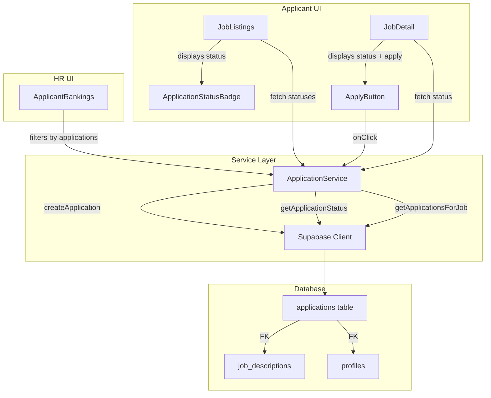

# Design Document: Job Application System

## Overview

The Job Application System adds explicit application functionality to the AI-Powered Job Matching Platform. Currently, HR users see all applicants ranked by match percentage regardless of expressed interest. This feature introduces an "Apply" action enabling applicants to signal interest in specific positions, and filters the HR rankings view to show only applicants who have explicitly applied.

The system integrates with the existing Supabase backend, adding a new `applications` table with RLS policies, a service layer for application management, and UI components for both applicant and HR workflows.

### Key Design Decisions

- **Optimistic UI with server confirmation**: The Apply button disables immediately on click, then confirms or reverts based on server response. This prevents double-submissions without blocking the user.
- **Service layer abstraction**: Application logic (create, check existence, list) lives in a dedicated service module (`src/lib/applications/`) rather than inline in components, enabling reuse across the detail page and listing card.
- **Database-level constraints**: Uniqueness and immutability are enforced at the PostgreSQL level (unique index, RLS deny-update policy) rather than relying solely on application code.
- **Extend existing ranking logic**: The `computeRanks` function in `ApplicantRankings.tsx` already handles sorting and tie-breaking. The change is to pre-filter its input to only include applied applicants.

## Architecture



### Data Flow

1. **Apply Flow**: Applicant clicks Apply → `ApplyButton` calls `ApplicationService.createApplication()` → Supabase inserts row → UI updates to "Applied" state
2. **Status Display Flow**: Page loads → Component calls `ApplicationService.getApplicationStatuses()` → Returns map of job_id → boolean → Components render status indicators
3. **HR Rankings Flow**: HR views rankings → `ApplicantRankings` fetches applications for job → Joins with match_results → Filters to applied only → Runs `computeRanks()` on filtered set

## Components and Interfaces

### New Components

#### `ApplyButton` (`src/components/applicant/ApplyButton.tsx`)

A client component handling the apply action with optimistic UI.

```typescript
interface ApplyButtonProps {
  jobId: string;
  initialStatus: 'not_applied' | 'applied';
  jobStatus: JobDescription['status'];
  onApplicationSuccess?: () => void;
}
```

**States:**
- `idle` — "Apply" button enabled (not yet applied)
- `submitting` — Button disabled, showing loading indicator
- `applied` — "Applied" button disabled with checkmark
- `error` — Error message displayed, button re-enabled

#### `ApplicationStatusBadge` (`src/components/applicant/ApplicationStatusBadge.tsx`)

A presentational component displaying "Applied" or "Not Applied" with distinct styling.

```typescript
interface ApplicationStatusBadgeProps {
  applied: boolean;
}
```

### Modified Components

#### `JobDetail` — Add `ApplyButton` to header section, fetch application status on mount
#### `JobListings` — Add `ApplicationStatusBadge` to each job card, batch-fetch statuses
#### `ApplicantRankings` — Filter match results to only include applicants with application records; display count and handle pending state for unscored applicants

### Service Layer

#### `ApplicationService` (`src/lib/applications/service.ts`)

```typescript
export interface Application {
  id: string;
  applicant_id: string;
  job_description_id: string;
  created_at: string;
}

export interface ApplicationService {
  /** Create a new application. Throws if duplicate or job not published. */
  createApplication(applicantId: string, jobId: string): Promise<Application>;

  /** Check if an applicant has applied to a specific job. */
  hasApplied(applicantId: string, jobId: string): Promise<boolean>;

  /** Get application statuses for multiple jobs (batch). Returns a Set of applied job IDs. */
  getAppliedJobIds(applicantId: string, jobIds: string[]): Promise<Set<string>>;

  /** Get all applications for a job (HR view). */
  getApplicationsForJob(jobId: string): Promise<Application[]>;
}
```

### API Route (optional server action alternative)

#### `POST /api/applications` (`src/app/api/applications/route.ts`)

```typescript
// Request
interface CreateApplicationRequest {
  job_description_id: string;
}

// Response (201)
interface CreateApplicationResponse {
  success: true;
  application: Application;
}

// Response (409 - duplicate)
interface DuplicateApplicationResponse {
  success: false;
  error: 'already_applied';
  message: string;
}

// Response (422 - job not published)
interface InvalidJobResponse {
  success: false;
  error: 'job_not_published';
  message: string;
}
```

The route authenticates via Supabase session, extracts `applicant_id` from the authenticated user, validates the job status, and inserts the application record.

## Data Models

### `applications` Table

```sql
CREATE TABLE public.applications (
  id UUID PRIMARY KEY DEFAULT gen_random_uuid(),
  applicant_id UUID NOT NULL REFERENCES public.profiles(id) ON DELETE CASCADE,
  job_description_id UUID NOT NULL REFERENCES public.job_descriptions(id) ON DELETE CASCADE,
  created_at TIMESTAMPTZ DEFAULT NOW(),
  UNIQUE(applicant_id, job_description_id)
);

-- Enable RLS
ALTER TABLE public.applications ENABLE ROW LEVEL SECURITY;

-- Applicants can insert their own applications
CREATE POLICY "Applicants can insert own applications"
  ON public.applications FOR INSERT
  WITH CHECK (applicant_id = auth.uid());

-- Applicants can read their own applications
CREATE POLICY "Applicants can read own applications"
  ON public.applications FOR SELECT
  USING (applicant_id = auth.uid());

-- HR users can read applications for their jobs
CREATE POLICY "HR users can read applications for own jobs"
  ON public.applications FOR SELECT
  USING (
    job_description_id IN (
      SELECT id FROM public.job_descriptions WHERE hr_user_id = auth.uid()
    )
  );

-- No UPDATE policy (immutable records)
-- No DELETE policy for users (only CASCADE from parent tables)
```

### TypeScript Type

```typescript
export interface Application {
  /** UUID primary key */
  id: string;
  /** UUID of the applicant who submitted the application */
  applicant_id: string;
  /** UUID of the job description applied to */
  job_description_id: string;
  /** ISO timestamp of when the application was submitted */
  created_at: string;
}
```

### Relationship to Existing Models

- `applications.applicant_id` → `profiles.id` (CASCADE delete)
- `applications.job_description_id` → `job_descriptions.id` (CASCADE delete)
- Applications join with `match_results` on `(applicant_id, job_description_id)` for ranked display

## Correctness Properties

*A property is a characteristic or behavior that should hold true across all valid executions of a system — essentially, a formal statement about what the system should do. Properties serve as the bridge between human-readable specifications and machine-verifiable correctness guarantees.*

### Property 1: Non-published job application rejection

*For any* job description with a status that is not "published" (i.e., "draft" or "closed"), and *for any* valid applicant, attempting to create an application for that job SHALL always be rejected by the application service.

**Validates: Requirements 1.7**

### Property 2: Application status derivation accuracy

*For any* list of job descriptions and *for any* set of application records belonging to an applicant, the status derivation function SHALL return "applied" for every job that has a matching application record and "not_applied" for every job that does not.

**Validates: Requirements 2.2, 3.1**

### Property 3: Duplicate application rejection

*For any* applicant-job pair where an application record already exists, attempting to create another application for the same pair SHALL always be rejected by the application service.

**Validates: Requirements 2.3**

### Property 4: Ranking filter to applied applicants only

*For any* set of applicants (some with application records for a job, some without), the ranking filter function SHALL return only those applicants who have an application record for that job, and no applicants without an application record shall appear in the result.

**Validates: Requirements 4.1**

### Property 5: Ranking sort with tie-breaking

*For any* list of applied applicants with match percentages, the computed ranking SHALL be sorted by match percentage descending, and *for any* group of applicants sharing the same match percentage, they SHALL be assigned the same rank number and ordered alphabetically by name within the group.

**Validates: Requirements 4.2, 4.3**

### Property 6: Pending status positioning for unscored applicants

*For any* ranking list containing both scored applicants (with match_result records) and unscored applicants (with application records but no match_result), all unscored applicants SHALL appear after all scored applicants in the final ordering.

**Validates: Requirements 4.7**

## Error Handling

| Scenario | Behavior | User Feedback |
|----------|----------|---------------|
| Network failure during apply | Catch error, re-enable button | "Failed to submit application. Please try again." |
| Duplicate application (409) | Service returns conflict | "You have already applied to this job." + update button to Applied |
| Job not published (422) | Service rejects pre-submit | Apply button not rendered for non-published jobs |
| Application status fetch failure | Graceful degradation | Job listings render without status badges; info message shown |
| RLS policy violation | Supabase returns error | Generic error message, logged for debugging |
| HR rankings fetch failure | Show error state | "Failed to load applicant rankings." with retry option |

### Error Recovery Strategy

- **Optimistic revert**: If the server rejects an apply action, the button reverts to its clickable state. No page reload required.
- **Stale status tolerance**: If application statuses fail to load, the listings page still renders jobs. Users can navigate to detail pages where status is fetched independently.
- **Conflict resolution**: A 409 (duplicate) is treated as a success from the user's perspective — the button updates to "Applied" since the desired end state is achieved.

## Testing Strategy

### Unit Tests

- `ApplicationService` functions: create, hasApplied, getAppliedJobIds, getApplicationsForJob (mocked Supabase)
- `ApplyButton` component states: idle, submitting, applied, error (React Testing Library)
- `ApplicationStatusBadge` rendering for both states
- Modified `ApplicantRankings` filtering logic
- API route validation (job status check, auth check)

### Property-Based Tests (fast-check)

This feature is suitable for property-based testing because:
- The status derivation, ranking filter, and sorting logic are pure functions with clear input/output behavior
- The input space (variable numbers of applicants, jobs, application records) is large
- Universal properties hold across all valid inputs

**Configuration:**
- Library: `fast-check` (already installed in the project)
- Minimum iterations: 100 per property
- Each test tagged with: `Feature: job-application-system, Property {number}: {property_text}`

Property tests will cover:
1. Non-published job rejection (Property 1)
2. Status derivation accuracy (Property 2)
3. Duplicate rejection (Property 3)
4. Ranking filter correctness (Property 4)
5. Ranking sort with tie-breaking (Property 5)
6. Pending applicant positioning (Property 6)

### Integration Tests

- End-to-end apply flow with real Supabase (test environment)
- RLS policy verification (applicant can't read others' apps, HR can only read own jobs' apps)
- CASCADE delete verification
- Unique constraint enforcement at DB level
- Immutability constraint (no updates allowed)

### Edge Cases

- Applicant applies to job, then job status changes to "closed" — existing application remains valid
- Rapid double-click on Apply button — only one request sent (optimistic disable)
- Applicant with application but no match_result — shown as "pending" in HR rankings
- HR user with zero applications for a job — empty state message
- Large number of applicants (100+) — pagination consideration for future
