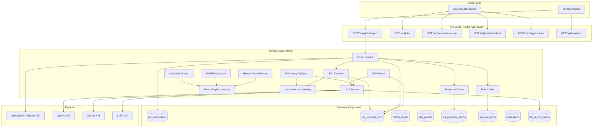

# Design Document: JSearch Job Import & Career Intelligence

## Overview

This design covers the full CareerFlow feature set: importing real job listings from external APIs (JSearch/Indeed via RapidAPI), enriching them with LLM-powered skill extraction, and providing intelligent career insights (ATS scoring, Hidden Gem detection, Skill ROI analysis, proficiency detection, candidate scoring, and smart filters). The system integrates with the existing Next.js 16 App Router architecture, Supabase PostgreSQL database, and a multi-provider LLM service for natural language understanding tasks.

The design follows a layered approach:
1. **Data Ingestion Layer** — API fetching, caching, deduplication, and storage
2. **LLM Service Layer** — Provider-agnostic LLM abstraction (OpenAI, Gemini, LLM7) with fallback and caching
3. **Intelligence Layer** — LLM-powered skill extraction, proficiency analysis, full ATS analysis (keyword extraction + intelligent matching + actionable suggestions); local algorithms for Hidden Gem detection, Skill ROI, candidate scoring
4. **Presentation Layer** — HR dashboard enhancements, applicant experience, filters, notifications, analytics

## Architecture



### LLM Integration Strategy

The system uses LLM API calls for three specific tasks that benefit from natural language understanding:
1. **Skill Extraction** — Extracting skills with contextual understanding from job descriptions
2. **Proficiency Detection** — Determining skill proficiency level from resume context
3. **ATS Analysis (Full Pipeline)** — Keyword extraction, intelligent matching (synonym/contextual awareness), and actionable resume improvement suggestions

**Key design decisions:**
- LLM calls happen **at data ingestion time** (job import, resume upload/update) and **on first ATS page view per applicant-job pair** — subsequent views served from cache
- Results are **cached in the database** and served from cache on all subsequent reads
- If all LLM providers (OpenAI → Gemini → LLM7) are unavailable, the system **gracefully degrades** to local algorithms (exact matching for ATS, keyword matching for skills/proficiency)
- Hidden Gem, Skill ROI, Candidate Scorer, and Pipeline Health remain **pure local algorithms** — they do not use LLM

## Components and Interfaces

### 1. Import Service (`src/lib/import/import-service.ts`)

The orchestrator for the job import pipeline. Coordinates cache checking, API fetching, deduplication, storage, and skill extraction.

```typescript
interface ImportOptions {
  query: string;           // Search query (default: "software developer")
  location: string;        // Location filter (default: "Philippines")
  forceRefresh: boolean;   // Bypass cache
  apiSource: 'jsearch' | 'indeed';  // Which API to use
}

interface ImportResult {
  success: boolean;
  importedCount: number;
  skippedDuplicates: number;
  cacheUsed: boolean;
  cacheTimestamp: string | null;
  warnings: string[];
  error?: string;
}

async function importJobs(options: ImportOptions): Promise<ImportResult>;
```

### 2. Rate Limiter (`src/lib/import/rate-limiter.ts`)

Tracks and enforces monthly API request limits using a database counter.

```typescript
interface RateLimitStatus {
  currentCount: number;
  limit: number;
  remaining: number;
  isExhausted: boolean;
  isNearLimit: boolean;  // >= 180 of 200
  resetsAt: string;      // ISO timestamp of month end
}

async function checkRateLimit(): Promise<RateLimitStatus>;
async function incrementRequestCount(): Promise<void>;
async function resetIfNewMonth(): Promise<void>;
```

### 3. Response Cache (`src/lib/import/response-cache.ts`)

Manages raw API response caching in the database.

```typescript
interface CachedResponse {
  id: string;
  query: string;
  location: string;
  apiSource: 'jsearch' | 'indeed';
  rawResponse: Record<string, unknown>;
  fetchedAt: string;
  jobCount: number;
}

async function getCachedResponse(query: string, location: string, apiSource: string): Promise<CachedResponse | null>;
async function storeCachedResponse(query: string, location: string, apiSource: string, response: Record<string, unknown>): Promise<CachedResponse>;
```

### 4. JSearch API Client (`src/lib/import/jsearch-client.ts`)

Handles communication with the JSearch/Indeed RapidAPI endpoints.

```typescript
interface JSearchJob {
  job_id: string;
  job_title: string;
  employer_name: string;
  employer_logo: string | null;
  job_description: string;
  job_city: string;
  job_state: string;
  job_country: string;
  job_employment_type: string;
  job_apply_link: string;
  job_highlights: {
    Qualifications?: string[];
    Responsibilities?: string[];
    Benefits?: string[];
  };
  job_min_salary: number | null;
  job_max_salary: number | null;
  job_salary_currency: string | null;
  job_salary_period: string | null;
  job_posted_at_datetime_utc: string;
}

interface JSearchResponse {
  status: string;
  data: JSearchJob[];
  request_id: string;
}

async function fetchJobs(query: string, location: string): Promise<JSearchResponse>;
```

### 5. LLM Service (`src/lib/llm/llm-service.ts`)

A provider-agnostic LLM abstraction that supports OpenAI, Gemini, and LLM7 with automatic fallback logic. Called only at data ingestion time (never on page views).

```typescript
type LLMProvider = 'openai' | 'gemini' | 'llm7';

interface LLMConfig {
  primaryProvider: LLMProvider;
  fallbackProviders: LLMProvider[];  // Tried in order if primary fails
  timeout: number;                    // Per-request timeout in ms (default: 30000)
  maxRetries: number;                 // Retries per provider (default: 1)
}

interface LLMRequest {
  prompt: string;
  systemPrompt?: string;
  responseFormat: 'json';    // Always request structured JSON
  temperature?: number;      // Default: 0.1 for deterministic outputs
}

interface LLMResponse {
  content: string;           // Raw JSON string from the model
  provider: LLMProvider;     // Which provider actually served the response
  cached: boolean;           // Whether result came from cache
  latencyMs: number;
}

interface LLMError {
  provider: LLMProvider;
  errorType: 'rate_limit' | 'auth_error' | 'timeout' | 'invalid_response' | 'network_error';
  message: string;
  retryable: boolean;
}

// Core service interface
async function complete(request: LLMRequest, config?: Partial<LLMConfig>): Promise<LLMResponse>;

// Checks cache before making LLM call; stores result on cache miss
async function completeWithCache(
  request: LLMRequest,
  cacheKey: string,          // Unique identifier (e.g., hash of job description)
  config?: Partial<LLMConfig>
): Promise<LLMResponse>;

// Provider-specific adapters
async function callOpenAI(request: LLMRequest): Promise<string>;
async function callGemini(request: LLMRequest): Promise<string>;
async function callLLM7(request: LLMRequest): Promise<string>;
```

**Fallback Logic:**
1. Try primary provider (default: OpenAI)
2. If rate limited, auth error, or timeout → try next fallback provider (Gemini)
3. If all providers fail → throw `LLMUnavailableError` (callers handle graceful degradation)

**Environment Variables:**
- `OPENAI_API_KEY` — OpenAI API key
- `GEMINI_API_KEY` — Gemini API key
- `LLM7_TOKEN` — LLM7 authentication token

### 6. Skill Extractor (`src/lib/import/skill-extractor.ts`)

Analyzes job text and extracts skills using LLM with context understanding. Falls back to local keyword matching if LLM is unavailable. Called once per imported job during import; results cached in `job_required_skills` table.

```typescript
interface ExtractedSkill {
  skillName: string;         // Normalized name via synonym map
  importance: 'required' | 'preferred';
  rawText: string;           // Original text where skill was found
  confidence: number;        // 0-1, confidence from LLM extraction
}

interface SkillExtractionSource {
  method: 'llm' | 'local';  // Which method was used
  provider?: LLMProvider;    // If LLM, which provider served the response
}

interface SkillExtractionResult {
  skills: ExtractedSkill[];
  source: SkillExtractionSource;
}

// Primary: LLM-based extraction with structured prompt
async function extractSkillsFromJob(
  description: string,
  qualifications: string | null,
  highlights: string[]
): Promise<SkillExtractionResult>;

// Fallback: local keyword matching (existing behavior)
function extractSkillsLocal(
  description: string,
  qualifications: string | null,
  highlights: string[]
): ExtractedSkill[];
```

**LLM Prompt Strategy (Skill Extraction):**
```
System: You are a technical recruiter AI that extracts skills from job descriptions.
Return a JSON array of objects with: skillName, importance ("required" or "preferred"), rawText.
Classify as "required" if the context says "must have", "required", "essential", "mandatory".
Classify as "preferred" if the context says "nice to have", "preferred", "bonus", "plus".

User: Extract all technical and soft skills from this job description:
{description}
Qualifications: {qualifications}
```

**Caching:** Results are stored in `job_required_skills` table keyed by `job_description_id`. The LLM is only called if no skills exist for the job (first import). If the job description changes, skills are re-extracted.

### 7. Deduplication Checker (`src/lib/import/deduplication.ts`)

Prevents duplicate imports using external job identifiers.

```typescript
async function findExistingExternalIds(externalIds: string[]): Promise<Set<string>>;
function isNewJob(externalId: string, existingIds: Set<string>): boolean;
```

### 8. Proficiency Analyzer (`src/lib/career-intelligence/proficiency-analyzer.ts`)

Determines skill proficiency level from resume context using LLM analysis. Falls back to local keyword matching if LLM is unavailable. Called once per resume upload/update; results cached in skill profile.

```typescript
interface ProficiencyResult {
  skillName: string;
  level: 'beginner' | 'intermediate' | 'expert';
  evidence: string;  // The text snippet that determined the level
  confidence: number; // 0-1, confidence from LLM analysis
}

interface ProficiencyAnalysisSource {
  method: 'llm' | 'local';
  provider?: LLMProvider;
}

interface ProficiencyBatchResult {
  results: ProficiencyResult[];
  source: ProficiencyAnalysisSource;
}

// Primary: LLM-based proficiency analysis
async function analyzeSkillProficiency(skillName: string, surroundingText: string): Promise<ProficiencyResult>;

// Batch analysis (single LLM call for all skills in a resume)
async function analyzeProficiencyBatch(skills: string[], resumeText: string): Promise<ProficiencyBatchResult>;

// Fallback: local keyword matching (existing behavior)
function analyzeProficiencyLocal(skillName: string, surroundingText: string): ProficiencyResult;
function analyzeProficiencyBatchLocal(skills: string[], resumeText: string): ProficiencyResult[];
```

**LLM Prompt Strategy (Proficiency Analysis):**
```
System: You are an expert career analyst. Analyze the resume text to determine 
skill proficiency levels. Return a JSON array of objects with: skillName, level 
("beginner", "intermediate", or "expert"), evidence (the relevant text snippet).

Guidelines:
- expert: Led teams, architected systems, 5+ years, mentored others, senior/principal roles
- intermediate: Used in projects, developed features, 2-4 years, implemented solutions
- beginner: Familiar with, basic knowledge, coursework, < 1 year, learning, exposure

User: Determine proficiency levels for these skills: {skills}
Resume text: {resumeText}
```

**Caching:** Results are stored in the `skill_profiles` table. The LLM is only called when:
- A resume is first uploaded
- A resume is updated (text content changes)
Results are NOT re-requested on profile page views or match calculations.

### 9. ATS Scorer (`src/lib/career-intelligence/ats-scorer.ts`)

A highly proficient ATS analysis engine that uses LLM for the **full ATS pipeline** — keyword extraction, intelligent matching (synonym/contextual awareness), and actionable improvement suggestions. The scoring formula remains `matched / total * 100`, but "matched" is now determined by LLM-powered contextual analysis rather than exact text matching. Falls back to local exact keyword matching only if all 3 LLM providers (OpenAI → Gemini → LLM7) are unavailable.

```typescript
interface ATSScoreResult {
  score: number;              // 0-100
  totalKeywords: number;
  matchedKeywords: ATSKeywordMatch[];  // Includes explanation of how each was matched
  missingKeywords: string[];
  suggestions: ATSSuggestion[];        // Actionable resume improvement suggestions
  analysisSource: 'llm' | 'local';    // Whether LLM or local fallback was used
}

interface ATSKeywordMatch {
  keyword: string;           // The job keyword that was matched
  matchedText: string;       // What in the resume matched this keyword
  matchType: 'exact' | 'synonym' | 'contextual';  // How it was matched
}

interface ATSSuggestion {
  keyword: string;           // The missing keyword to address
  section: string;           // Where to add it (e.g., "Skills", "Experience at Company X")
  suggestion: string;        // Specific actionable text (e.g., "Add 'Docker' to your technical skills section")
  impact: 'high' | 'medium' | 'low';  // How much this would improve the score
}

interface CachedKeywords {
  jobDescriptionId: string;
  keywords: string[];
  extractedAt: string;
  source: 'llm' | 'local';
}

interface CachedATSAnalysis {
  matchedKeywords: ATSKeywordMatch[];
  missingKeywords: string[];
  suggestions: ATSSuggestion[];
  analysisSource: 'llm' | 'local';
}

// Full ATS scoring pipeline (orchestrator)
async function calculateATSScore(
  resumeText: string,
  jobDescription: string,
  qualifications: string | null,
  jobDescriptionId: string,
  jobId: string
): Promise<ATSScoreResult>;

// Step 1: Keyword extraction with LLM (called once per job, cached per job)
async function extractKeywords(
  jobDescription: string,
  qualifications: string | null,
  jobDescriptionId: string
): Promise<{ keywords: string[]; source: 'llm' | 'local' }>;

// Step 2: Intelligent matching + suggestions with LLM (called once per applicant-job pair, cached)
async function analyzeResumeMatch(
  resumeText: string,
  keywords: string[],
  jobId: string,
  resumeHash: string
): Promise<CachedATSAnalysis>;

// Local fallback: exact keyword matching (used when all 3 LLMs are unavailable)
function matchKeywordsLocal(resumeText: string, keywords: string[]): CachedATSAnalysis;

// Local fallback: TF-IDF keyword extraction (used when all 3 LLMs are unavailable)
function extractKeywordsLocal(text: string, minCount: number): string[];
```

**LLM Prompt Strategy (ATS Keyword Extraction — Step 1, cached per job):**
```
System: You are an ATS (Applicant Tracking System) specialist. Extract the most 
important keywords that an ATS would scan for in a resume. Focus on: technical skills, 
tools, methodologies, certifications, and domain-specific terms. Return a JSON array 
of strings. Aim for 10-20 keywords ordered by importance.

User: Extract ATS keywords from this job description:
{jobDescription}
Qualifications: {qualifications}
```

**LLM Prompt Strategy (Intelligent Matching + Suggestions — Step 2, cached per applicant-job pair):**
```
System: You are an expert ATS (Applicant Tracking System) analyst. Compare the 
applicant's resume against the required keywords for a job. For each keyword, 
determine if the resume demonstrates that skill/qualification — consider synonyms, 
equivalent phrases, and contextual evidence (not just exact word match).

Matching rules:
- "React.js" = "React" = "ReactJS" (synonyms)
- "CI/CD pipelines" = "continuous integration and deployment" (phrase equivalence)
- "managed a team of 5 engineers" implies "leadership" and "team management" (contextual)
- "AWS" = "Amazon Web Services" (abbreviation equivalence)

Then generate actionable suggestions for missing keywords: specify WHERE in the 
resume to add them and HOW to phrase them naturally. Prioritize suggestions by 
impact (high = would significantly improve score, medium = moderate improvement, 
low = minor improvement).

Return JSON with:
{
  "matchedKeywords": [{"keyword": "...", "matchedText": "...", "matchType": "exact|synonym|contextual"}],
  "missingKeywords": ["..."],
  "suggestions": [{"keyword": "...", "section": "...", "suggestion": "...", "impact": "high|medium|low"}]
}

User: 
Job Keywords: {keywords}
Resume Text: {resumeText}
```

**Caching Strategy:**
- **Keywords per job**: Cached in `llm_results_cache` with key = `SHA256(job_description_text) + "ats_keywords"`. Re-extracted only when job description text changes (source_hash mismatch).
- **Match + suggestions per applicant-job pair**: Cached in `llm_results_cache` with key = `SHA256(resume_text) + job_id + "ats_analysis"`. Invalidated when resume text changes OR job description changes (detected via source_hash mismatch on either input).
- **First page view** for a new applicant-job pair triggers the LLM call; subsequent views are served from cache.
- **Score computation**: Always computed fresh as `Math.round((matchedKeywords.length / totalKeywords) * 100)` from cached match data — the score itself is not cached.

**Local Fallback (all 3 LLMs unavailable):**
When OpenAI, Gemini, and LLM7 are all unavailable:
- Keyword extraction falls back to TF-IDF (`extractKeywordsLocal`)
- Matching falls back to exact case-insensitive text search (`matchKeywordsLocal`)
- Suggestions are generated as simple "Add '{keyword}' to your resume" without section-specific advice
- `analysisSource` is set to `'local'` to indicate reduced accuracy
- The score still works correctly — just less nuanced matching (no synonym/contextual awareness)

### 10. Hidden Gem Detector (`src/lib/career-intelligence/hidden-gem-detector.ts`)

Identifies high-growth opportunity jobs.

```typescript
interface HiddenGemResult {
  isHiddenGem: boolean;
  matchPercentage: number;
  missingSkills: string[];
  easySkills: string[];
  hardSkills: string[];
  easySkillRatio: number;   // e.g., 0.75 means 75% are easy
}

function detectHiddenGem(matchPercentage: number, missingSkills: string[]): HiddenGemResult;
function classifySkillDifficulty(skillName: string): 'easy' | 'hard';
```

### 11. Skill ROI Analyzer (`src/lib/career-intelligence/skill-roi-analyzer.ts`)

Simulates skill additions and computes match improvement.

```typescript
interface SkillROIResult {
  skillName: string;
  currentScore: number;
  projectedScore: number;
  scoreDelta: number;
}

async function analyzeSkillROI(
  applicantSkills: string[],
  jobRequiredSkills: Array<{ skill_name: string; importance: 'required' | 'preferred' }>,
  missingSkills: string[],
  topN?: number  // default: 5
): Promise<SkillROIResult[]>;
```

### 12. Candidate Scorer (`src/lib/career-intelligence/candidate-scorer.ts`)

Calculates "Ready Now" and "High Potential" scores plus "At Risk" status.

```typescript
interface CandidateScore {
  readyNowScore: number;       // Current match %
  highPotentialScore: number;  // Match after simulating 2 easiest skills
  isHighGrowth: boolean;       // Difference >= 10 points
  easiestSkillsToLearn: string[];
}

interface AtRiskStatus {
  isAtRisk: boolean;
  highMatchJobCount: number;   // Jobs with 85%+ match
  threshold: number;           // 3
}

async function calculateCandidateScores(applicantSkills: string[], jobRequiredSkills: Array<{ skill_name: string; importance: 'required' | 'preferred' }>): Promise<CandidateScore>;
async function checkAtRiskStatus(applicantId: string): Promise<AtRiskStatus>;
```

## Data Models

### New Database Tables

#### `api_response_cache`

| Column | Type | Constraints | Description |
|--------|------|-------------|-------------|
| id | uuid | PK, default gen_random_uuid() | Primary key |
| query | text | NOT NULL | Search query used |
| location | text | NOT NULL | Location filter used |
| api_source | text | NOT NULL | 'jsearch' or 'indeed' |
| raw_response | jsonb | NOT NULL | Complete raw API response |
| job_count | integer | NOT NULL | Number of jobs in response |
| fetched_at | timestamptz | NOT NULL, default now() | When the data was fetched |
| created_at | timestamptz | NOT NULL, default now() | Record creation time |

Unique constraint: `(query, location, api_source)`

#### `api_rate_limits`

| Column | Type | Constraints | Description |
|--------|------|-------------|-------------|
| id | uuid | PK, default gen_random_uuid() | Primary key |
| api_source | text | NOT NULL, UNIQUE | 'jsearch' or 'indeed' |
| request_count | integer | NOT NULL, default 0 | Requests made this month |
| month_year | text | NOT NULL | 'YYYY-MM' format |
| limit_max | integer | NOT NULL, default 200 | Maximum monthly requests |
| updated_at | timestamptz | NOT NULL, default now() | Last update time |

#### `skill_difficulty_catalog`

| Column | Type | Constraints | Description |
|--------|------|-------------|-------------|
| id | uuid | PK, default gen_random_uuid() | Primary key |
| skill_name | text | NOT NULL, UNIQUE | Normalized skill name |
| difficulty | text | NOT NULL | 'easy' or 'hard' |
| category | text | | Skill category (soft, tool, language, etc.) |
| created_at | timestamptz | NOT NULL, default now() | Record creation time |

#### `applications`

| Column | Type | Constraints | Description |
|--------|------|-------------|-------------|
| id | uuid | PK, default gen_random_uuid() | Primary key |
| applicant_id | uuid | NOT NULL, FK profiles(id) | Applicant who applied |
| job_description_id | uuid | NOT NULL, FK job_descriptions(id) | Job applied to |
| status | text | NOT NULL | 'applied', 'applied_externally', 'reviewed', 'shortlisted', 'rejected' |
| applied_at | timestamptz | NOT NULL, default now() | When application was made |

Unique constraint: `(applicant_id, job_description_id)`

#### `llm_results_cache`

| Column | Type | Constraints | Description |
|--------|------|-------------|-------------|
| id | uuid | PK, default gen_random_uuid() | Primary key |
| cache_key | text | NOT NULL | Unique key (e.g., hash of input text + operation) |
| operation_type | text | NOT NULL | 'skill_extraction', 'proficiency_analysis', 'ats_keywords', 'ats_analysis' |
| source_id | uuid | NULL | FK to job_descriptions or skill_profiles |
| source_hash | text | NOT NULL | SHA-256 hash of source text (to detect changes) |
| result_json | jsonb | NOT NULL | Cached LLM response (parsed JSON) |
| provider | text | NOT NULL | Which LLM provider produced this result |
| created_at | timestamptz | NOT NULL, default now() | When result was cached |
| updated_at | timestamptz | NOT NULL, default now() | Last update time |

Unique constraint: `(cache_key, operation_type)`

Index: `idx_llm_cache_source` on `(source_id, operation_type)`

**Cache Invalidation Rules:**
- Skill extraction: invalidated when job description text changes (detected by `source_hash` mismatch)
- Proficiency analysis: invalidated when resume text changes
- ATS keywords: invalidated when job description text changes
- ATS analysis (match + suggestions): invalidated when resume text changes OR job description changes (keyed by `resume_hash + job_id + "ats_analysis"`)

### Extended Columns on `job_descriptions`

| Column | Type | Description |
|--------|------|-------------|
| external_job_id | text | NULL | External API job identifier for deduplication |
| source | text | NULL | 'jsearch', 'indeed', or NULL for manual |
| source_company | text | NULL | Original company name from API |
| job_link | text | NULL | External application URL |
| salary_min | numeric | NULL | Minimum salary |
| salary_max | numeric | NULL | Maximum salary |
| salary_currency | text | NULL | Currency code (e.g., 'PHP') |
| salary_period | text | NULL | Period (e.g., 'month', 'year') |
| employment_type | text | NULL | 'full-time', 'part-time', 'contract', etc. |
| location_city | text | NULL | City |
| location_state | text | NULL | State/Province |
| highlights | jsonb | NULL | Job highlights from API |
| imported_at | timestamptz | NULL | When the job was imported |

### Extended Columns on `skill_profiles`

| Column | Type | Description |
|--------|------|-------------|
| total_years_experience | numeric | NULL | Calculated total years of experience |
| work_experience | jsonb | NULL | Array of work experience entries |
| education | jsonb | NULL | Array of education entries |
| certifications | jsonb | NULL | Array of certification entries |
| external_urls | jsonb | NULL | LinkedIn, GitHub, portfolio URLs |
| work_preferences | jsonb | NULL | Remote/onsite, relocate, target industries |

### Extended Columns on `skills`

| Column | Type | Description |
|--------|------|-------------|
| last_used_at | timestamptz | NULL | When skill was last used |
| added_at | timestamptz | default now() | When skill was added to profile |


## Correctness Properties

*A property is a characteristic or behavior that should hold true across all valid executions of a system — essentially, a formal statement about what the system should do. Properties serve as the bridge between human-readable specifications and machine-verifiable correctness guarantees.*

### Property 1: Cache Round-Trip Preservation

*For any* valid API response object stored in the Raw_Response_Cache, retrieving the cached response for the same query, location, and API source SHALL produce a JSON-equal copy of the original response.

**Validates: Requirements 2.1, 2.4**

### Property 2: Job Mapping Completeness

*For any* valid JSearch API job object, the mapped `job_descriptions` database record SHALL contain: the job title from `job_title`, description from `job_description`, the system user as `hr_user_id`, status as `published`, the external job ID from `job_id`, source attribution ('jsearch' or 'indeed'), the original company name from `employer_name`, the application link from `job_apply_link`, and all available salary/location/highlights metadata mapped to the corresponding columns.

**Validates: Requirements 3.1, 3.2, 3.3, 3.4, 3.5, 3.6, 10.5**

### Property 3: Import Idempotence

*For any* set of job listings from the JSearch API, importing the same set of jobs twice SHALL result in the same number of `job_descriptions` records as importing once — the second import produces zero new records and all jobs are reported as skipped duplicates.

**Validates: Requirements 5.1, 5.2**

### Property 4: Import Count Invariant

*For any* import operation processing N total jobs from the API response, the sum of `importedCount` and `skippedDuplicates` in the result SHALL equal N.

**Validates: Requirements 5.3, 9.5**

### Property 5: Rate Limit Enforcement

*For any* monthly request count >= 200, the Import_Service SHALL reject the import request without making an external API call, and for any count >= 180 but < 200, a warning SHALL be included in the response.

**Validates: Requirements 6.2, 6.3**

### Property 6: Rate Limit Monthly Reset

*For any* two rate limit checks where the second check occurs in a different calendar month than the stored `month_year`, the request counter SHALL be reset to zero before evaluation.

**Validates: Requirements 6.4**

### Property 7: Proficiency Classification from Context

*For any* skill mention surrounded by text containing expert indicators ("led", "architected", "5+ years", "mentored", "senior", "principal"), the Proficiency_Analyzer SHALL classify it as `expert`. *For any* text containing intermediate indicators ("used", "developed", "2-4 years", "implemented", "contributed"), classification SHALL be `intermediate`. *For any* text containing beginner indicators ("familiar", "basic", "course", "1 year", "learning", "exposure"), classification SHALL be `beginner`. *For any* text containing none of these indicators, the default classification SHALL be `intermediate`.

**Validates: Requirements 11.2, 11.3, 11.4, 11.5**

### Property 8: ATS Score Formula

*For any* resume text and job description, the ATS score SHALL equal `Math.round((matchedKeywords.length / totalKeywords) * 100)` where `matchedKeywords` is the list of keywords determined as matched (by LLM contextual analysis or local exact matching), and the result SHALL always be in the range [0, 100] inclusive. The scoring formula remains the same regardless of whether `analysisSource` is `'llm'` or `'local'`.

**Validates: Requirements 12.1, 12.3, 12.4**

### Property 20: ATS Intelligent Matching Consistency

*For any* resume text and set of job keywords analyzed by the LLM, every keyword SHALL appear in exactly one of `matchedKeywords` or `missingKeywords` (mutual exclusivity and exhaustive coverage). The sum `matchedKeywords.length + missingKeywords.length` SHALL equal `totalKeywords`.

**Validates: Requirements 12.2, 12.3**

### Property 21: ATS Suggestion Coverage

*For any* ATS analysis result where `missingKeywords` is non-empty, the `suggestions` array SHALL contain at least one suggestion for each missing keyword. Each suggestion SHALL reference a valid `section` (non-empty string), a specific `suggestion` text (non-empty string), and an `impact` value of exactly `'high'`, `'medium'`, or `'low'`. Suggestions SHALL be ordered by impact (high first, then medium, then low).

**Validates: Requirements 12.5**

### Property 22: ATS Cache Invalidation on Resume or Job Change

*For any* applicant-job pair whose ATS analysis has been previously cached, if either the resume text changes (different SHA-256 hash) OR the job description changes, the next `calculateATSScore` call SHALL make a fresh LLM request for the matching step and update the cache, rather than returning the stale cached result.

**Validates: Requirements 12.7**

### Property 9: Hidden Gem Detection Logic

*For any* applicant-job pair where the match percentage is in [60, 79] and more than 50% of missing skills are classified as Easy_Skills, the Hidden_Gem_Detector SHALL mark the job as a Hidden Gem. *For any* match percentage outside [60, 79], the job SHALL NOT be marked as a Hidden Gem regardless of skill difficulty.

**Validates: Requirements 13.1, 13.3, 13.4**

### Property 10: Skill ROI Monotonicity and Ordering

*For any* set of missing skills analyzed by the Skill_ROI_Analyzer, each `scoreDelta` SHALL be >= 0 (adding a skill never decreases the match score), and the result array SHALL be sorted by `scoreDelta` in descending order.

**Validates: Requirements 14.2, 14.3**

### Property 11: High Potential Score Monotonicity and High Growth Threshold

*For any* applicant-job pair, the `highPotentialScore` SHALL be >= `readyNowScore` (simulating additional skills never decreases the score), and `isHighGrowth` SHALL be true if and only if `highPotentialScore - readyNowScore >= 10`.

**Validates: Requirements 15.2, 15.5**

### Property 12: At Risk Threshold Logic

*For any* applicant, `isAtRisk` SHALL be true if and only if `highMatchJobCount >= 3` (where highMatchJobCount is the number of published jobs with match score >= 85%).

**Validates: Requirements 16.1**

### Property 13: Pipeline Tier Classification

*For any* match percentage value, it SHALL be classified into exactly one tier: 🟢 Top Tier (90-100), 🟡 Good Fit (75-89), 🟠 Potential (60-74), or 🔴 Gap (0-59). The tiers are mutually exclusive and exhaustive over [0, 100].

**Validates: Requirements 18.2**

### Property 14: Skill Extraction and Normalization

*For any* skill name that exists in the synonym map, the Skill_Extractor SHALL normalize it to the canonical form. *For any* job description text containing a known skill term within "must have" or "required" context, the extracted skill SHALL have importance `required`. *For any* skill term within "nice to have" or "preferred" context, importance SHALL be `preferred`.

**Validates: Requirements 4.3, 4.4**

### Property 15: LLM Provider Fallback Correctness

*For any* sequence of LLM requests where the primary provider returns a rate limit or error response, the LLM Service SHALL attempt the next fallback provider in order. *For any* sequence where at least one provider returns a valid response, the overall request SHALL succeed with that provider's response.

**Validates: Requirements 4.1, 11.1, 12.2**

### Property 16: LLM Result Cache Idempotence

*For any* identical source data (same job description text or same resume text), calling the LLM-powered extraction a second time SHALL return the cached result without making a new LLM API call. The cached result SHALL be byte-equivalent to the first call's result.

**Validates: Requirements 4.1, 11.1, 12.2**

### Property 17: LLM Graceful Degradation

*For any* scenario where all LLM providers are unavailable (rate limited, errored, or timed out), the Skill Extractor, Proficiency Analyzer, and ATS Scorer SHALL each produce a valid result using the local fallback approach. Specifically for the ATS Scorer: keyword extraction falls back to TF-IDF, matching falls back to exact text search, and suggestions fall back to generic recommendations. The fallback result SHALL conform to the same interface types as the LLM result, with `analysisSource` set to `'local'`.

**Validates: Requirements 4.1, 11.1, 12.2**

### Property 18: LLM Cache Invalidation on Source Change

*For any* source data (job description or resume) that has been previously cached, if the source text changes (different SHA-256 hash), the next extraction call SHALL make a fresh LLM request and update the cache, rather than returning the stale cached result.

**Validates: Requirements 4.1, 11.1, 12.2**

### Property 19: LLM Response JSON Parsing Robustness

*For any* valid JSON response from the LLM matching the expected schema (array of skill objects with skillName, importance, rawText), the parser SHALL produce a valid `ExtractedSkill[]` array. *For any* malformed or non-JSON LLM response, the parser SHALL fall back to the local extraction method rather than throwing an unhandled error.

**Validates: Requirements 4.1, 11.1, 12.2**

## Error Handling

### API Layer Errors

| Error Condition | Response Code | Response Body | User-Facing Message |
|----------------|--------------|---------------|---------------------|
| Unauthenticated request | 401 | `{ error: "Unauthorized" }` | "Please log in to continue" |
| Unauthorized role | 403 | `{ error: "Forbidden" }` | "You don't have permission to perform this action" |
| Missing RAPIDAPI_KEY | 500 | `{ error: "Configuration error: API key not configured" }` | "Import service is not configured. Contact admin." |
| Missing LLM API keys | 500 | `{ error: "Configuration error: No LLM provider configured" }` | "Intelligence service is not configured. Contact admin." |
| Rate limit exceeded | 429 | `{ error: "Monthly API quota exhausted", resetsAt: "..." }` | "API quota reached. Try again next month or use cached data." |
| LLM rate limited (all providers) | 200 | `{ warnings: ["LLM unavailable, used local extraction"] }` | (transparent — import succeeds with local fallback) |
| ATS LLM unavailable (all providers) | 200 | `{ analysisSource: "local", warnings: ["ATS analysis used local matching — results may be less accurate"] }` | "Score calculated using basic matching. LLM-powered analysis temporarily unavailable." |
| External API error | 502 | `{ error: "External API error", details: "..." }` | "Failed to fetch jobs from external source. Try again later." |
| External API timeout | 504 | `{ error: "External API timeout" }` | "External service took too long. Try again." |
| Invalid request body | 400 | `{ error: "Invalid request parameters" }` | "Please check your input and try again." |

### Service Layer Error Handling Strategy

1. **Import Service**: Wraps all external calls in try/catch. On API failure, returns partial results (jobs already processed) with error details in the `warnings` array. Never throws unhandled exceptions.

2. **LLM Service**: Implements cascading fallback across providers. On primary provider failure (rate limit, auth error, timeout, network error), automatically tries the next configured fallback provider. Tracks per-provider error rates for observability. If all providers fail, throws `LLMUnavailableError` which callers handle via graceful degradation.

3. **Skill Extractor**: If LLM extraction fails (all providers unavailable or malformed response), falls back to local keyword-based extraction using the synonym map. Logs the fallback event. If even local extraction fails for a single job, logs the error and continues with remaining jobs. Returns an empty skills array for that job rather than failing the entire import.

4. **Proficiency Analyzer**: If LLM analysis fails, falls back to local keyword matching (existing indicator-based logic: "led"/"architected" → expert, "used"/"developed" → intermediate, "familiar"/"basic" → beginner). If fallback also fails for a skill, defaults to `intermediate`.

5. **ATS Scorer**: The full ATS pipeline (keyword extraction, intelligent matching, suggestions) uses LLM with cascading fallback (OpenAI → Gemini → LLM7). If all 3 LLM providers are unavailable:
   - Keyword extraction falls back to local TF-IDF extraction
   - Matching falls back to exact case-insensitive text search (no synonym/contextual awareness)
   - Suggestions fall back to generic "Add '{keyword}' to your resume" without section-specific advice
   - `analysisSource` is set to `'local'` to signal reduced accuracy to the UI
   - If keyword extraction yields zero keywords by any method, returns score of 0 with an appropriate message rather than dividing by zero
   - If LLM returns malformed JSON for the matching step, the system falls back to local matching for that specific call and logs the parsing error

6. **Rate Limiter**: If the rate limit table is unreachable, fails open with a warning (allows the request but logs the issue). This prevents database outages from blocking all imports.

7. **Cache**: If cache read fails, proceeds as if no cache exists (fetches fresh). If cache write fails, proceeds with import but includes a warning.

8. **Hidden Gem Detector / Skill ROI Analyzer**: If the skill difficulty catalog lookup fails, those skills are treated as 'hard' (conservative default).

### Client-Side Error Handling

- All API calls from dashboard components use try/catch with toast notifications for non-critical errors and modal dialogs for critical errors (per Requirement 23).
- Loading states disable action buttons to prevent duplicate submissions (per Requirement 7.5).
- Network failures show a retry option.

## Testing Strategy

### Property-Based Testing (PBT)

This feature is well-suited for property-based testing due to the pure computation logic in the intelligence layer. We will use **fast-check** (already installed) with **Vitest** (already configured).

**Configuration:**
- Minimum 100 iterations per property test
- Each property test tagged with: `Feature: jsearch-job-import, Property {N}: {title}`
- Property tests located in `src/lib/**/*.property.test.ts` files

**Properties to implement as PBT:**
- Property 1: Cache round-trip (serialization/deserialization)
- Property 2: Job mapping completeness
- Property 3: Import idempotence
- Property 4: Import count invariant
- Property 5: Rate limit enforcement
- Property 6: Rate limit monthly reset
- Property 7: Proficiency classification (fallback path)
- Property 8: ATS score formula
- Property 20: ATS intelligent matching consistency (matched + missing = total)
- Property 21: ATS suggestion coverage (every missing keyword has a suggestion)
- Property 22: ATS cache invalidation on resume or job change
- Property 9: Hidden Gem detection
- Property 10: Skill ROI monotonicity and ordering
- Property 11: High Potential monotonicity and threshold
- Property 12: At Risk threshold
- Property 13: Pipeline tier classification
- Property 14: Skill extraction and normalization
- Property 15: LLM provider fallback correctness
- Property 16: LLM result cache idempotence
- Property 17: LLM graceful degradation (includes full ATS pipeline fallback)
- Property 18: LLM cache invalidation on source change
- Property 19: LLM response JSON parsing robustness

### Unit Tests (Example-Based)

Located in `src/lib/**/*.test.ts` and `src/app/**/*.test.tsx`:

- Import Service: happy path with mocked API, error cases, force refresh flow
- LLM Service: provider-specific adapter tests (mocked HTTP), config validation, timeout behavior
- Skill Extractor: LLM prompt construction, response parsing, synonym normalization
- Proficiency Analyzer: LLM prompt construction, batch processing, fallback trigger
- ATS Scorer: LLM keyword extraction, LLM intelligent matching, suggestion generation, scoring formula edge cases (0 keywords, all matched, synonym matching, contextual matching), local fallback path
- HR Dashboard components: button rendering, loading states, success/error messages
- Applicant components: job card rendering, filter interactions, application dialogs
- API routes: auth checks (401/403), parameter validation, response shapes
- Notification system: toast display, modal behavior, auto-dismiss timing

### Integration Tests

- Full import pipeline: API mock → cache → dedup → DB storage → LLM skill extraction → fallback
- LLM integration: real provider round-trip (run manually, not in CI) with test job descriptions
- Proficiency pipeline: resume upload → LLM analysis → skill profile update → cache verification
- ATS pipeline: job import → LLM keyword extraction → LLM intelligent matching → suggestion generation → score calculation → cache verification → local fallback path verification
- Application flow: apply to external job, apply to internal job, track status
- Match recalculation trigger on profile update

### Test File Organization

```
src/
├── lib/
│   ├── llm/
│   │   ├── llm-service.test.ts              # Unit tests for LLM service
│   │   ├── llm-service.property.test.ts     # PBT: Properties 15, 16, 18, 19
│   │   └── providers/
│   │       ├── openai.test.ts               # OpenAI adapter unit tests
│   │       ├── gemini.test.ts               # Gemini adapter unit tests
│   │       └── llm7.test.ts                 # LLM7 adapter unit tests
│   ├── import/
│   │   ├── import-service.test.ts           # Unit tests
│   │   ├── import-service.property.test.ts  # PBT: Properties 2, 3, 4
│   │   ├── rate-limiter.property.test.ts    # PBT: Properties 5, 6
│   │   ├── response-cache.property.test.ts  # PBT: Property 1
│   │   ├── skill-extractor.test.ts          # Unit tests (LLM prompt, parsing)
│   │   ├── skill-extractor.property.test.ts # PBT: Properties 14, 17
│   │   └── deduplication.test.ts            # Unit tests
│   └── career-intelligence/
│       ├── proficiency-analyzer.test.ts          # Unit tests (LLM prompt, parsing)
│       ├── proficiency-analyzer.property.test.ts # PBT: Property 7, 17
│       ├── ats-scorer.test.ts                    # Unit tests (LLM keywords, matching, suggestions)
│       ├── ats-scorer.property.test.ts           # PBT: Property 8, 17, 20, 21, 22
│       ├── hidden-gem-detector.property.test.ts  # PBT: Property 9
│       ├── skill-roi-analyzer.property.test.ts   # PBT: Property 10
│       ├── candidate-scorer.property.test.ts     # PBT: Properties 11, 12
│       └── pipeline-health.property.test.ts      # PBT: Property 13
└── app/
    ├── api/jobs/import/route.test.ts        # API route unit tests
    └── (dashboard)/
        ├── hr/import-button.test.tsx        # Component tests
        └── applicant/job-filters.test.tsx   # Component tests
```
