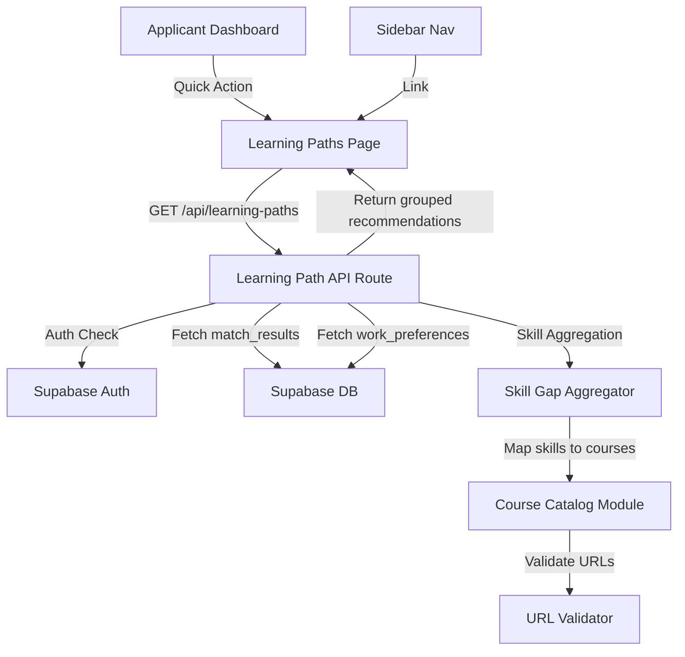

# Design Document: Learning Path Integration

## Overview

This feature adds a **Learning Paths** page to the applicant dashboard that recommends legitimate online courses based on the applicant's identified skill gaps. The system uses a static course catalog mapped to known skills, ensuring all recommended links point to real courses on verified platforms. The feature integrates with the existing gap analysis system (match results and role readiness) to provide personalized recommendations.

The feature consists of:
- A new page at `/applicant/learning-paths` displaying course recommendations grouped by missing skill
- A backend API at `/api/learning-paths` that aggregates skill gaps and maps them to catalog entries
- A recommendation engine module that handles skill-to-course mapping, URL validation, and response shaping
- Dashboard quick action and sidebar navigation integration

## Architecture



**Data Flow:**
1. Applicant navigates to the Learning Paths page (via sidebar or dashboard quick action)
2. Page component calls `GET /api/learning-paths`
3. API authenticates the user, fetches match results and career goal
4. Skill Gap Aggregator merges missing skills from both sources, deduplicates, and ranks by frequency
5. Course Catalog Module maps each skill to pre-configured course entries
6. URL Validator ensures all URLs match approved platform patterns
7. API returns grouped, sorted, and capped course recommendations
8. Page renders recommendations with proper formatting, accessibility, and responsiveness

## Components and Interfaces

### Frontend Components

| Component | Path | Responsibility |
|-----------|------|----------------|
| `LearningPathsPage` | `src/app/(dashboard)/applicant/learning-paths/page.tsx` | Page component handling data fetching, loading/error/empty states |
| `SkillGapSection` | `src/components/applicant/SkillGapSection.tsx` | Renders a single skill gap group with its course recommendations |
| `CourseCard` | `src/components/applicant/CourseCard.tsx` | Renders an individual course recommendation card |

### Backend Modules

| Module | Path | Responsibility |
|--------|------|----------------|
| `Learning Path API` | `src/app/api/learning-paths/route.ts` | API route handling auth, data aggregation, and response |
| `Course Catalog` | `src/lib/learning-paths/course-catalog.ts` | Static mapping of skills to verified course entries |
| `Skill Gap Aggregator` | `src/lib/learning-paths/skill-gap-aggregator.ts` | Merges, deduplicates, and ranks skill gaps from multiple sources |
| `URL Validator` | `src/lib/learning-paths/url-validator.ts` | Validates course URLs against approved domain/path patterns |

### Key Interfaces

```typescript
/** A single course entry in the static catalog */
interface CatalogCourseEntry {
  title: string;
  platform: CoursePlatform;
  url: string;
  skills: string[];           // skills this course covers
  durationHours: number;
  hasCertificate: boolean;
}

/** Supported platform identifiers */
type CoursePlatform = 
  | 'Coursera' | 'Udemy' | 'DataCamp' 
  | 'LinkedIn Learning' | 'edX' | 'Pluralsight' | 'Codecademy';

/** Approved URL patterns per platform */
interface ApprovedUrlPattern {
  domain: string;
  pathPrefix: string;
}

/** Aggregated skill gap with metadata */
interface AggregatedSkillGap {
  skillName: string;
  jobCount: number;          // number of jobs requiring this skill
  totalJobs: number;         // total matched jobs
  source: 'Job Matches' | 'Career Goal' | 'Both';
}

/** API response shape */
interface LearningPathResponse {
  success: boolean;
  data: SkillGapGroup[];
  error?: string;
}

interface SkillGapGroup {
  skill: AggregatedSkillGap;
  courses: CourseRecommendation[];
}

interface CourseRecommendation {
  title: string;
  platform: CoursePlatform;
  url: string;
  skill: string;
  durationHours: number;
  hasCertificate: boolean;
  impactScore: number;
}
```

## Data Models

### Static Course Catalog

The course catalog is a static TypeScript file (`course-catalog.ts`) containing pre-verified course entries. No database table is needed since courses are curated and updated via code deployments.

```typescript
// Example structure in course-catalog.ts
export const COURSE_CATALOG: CatalogCourseEntry[] = [
  {
    title: "Python for Everybody Specialization",
    platform: "Coursera",
    url: "https://coursera.org/learn/python",
    skills: ["Python", "Programming"],
    durationHours: 8,
    hasCertificate: true,
  },
  // ... more entries
];
```

### Approved URL Patterns

```typescript
export const APPROVED_URL_PATTERNS: ApprovedUrlPattern[] = [
  { domain: "coursera.org", pathPrefix: "/learn/" },
  { domain: "udemy.com", pathPrefix: "/course/" },
  { domain: "datacamp.com", pathPrefix: "/courses/" },
  { domain: "linkedin.com", pathPrefix: "/learning/" },
  { domain: "edx.org", pathPrefix: "/learn/" },
  { domain: "pluralsight.com", pathPrefix: "/courses/" },
  { domain: "codecademy.com", pathPrefix: "/learn/" },
];
```

### Existing Tables Used (read-only)

- `match_results` — source of missing skills per job match
- `skill_profiles` — source of career goal (via `work_preferences.careerGoal`)
- `skills` — applicant's current skills for role readiness calculation

No new database tables or migrations are required for this feature.

## Correctness Properties

*A property is a characteristic or behavior that should hold true across all valid executions of a system—essentially, a formal statement about what the system should do. Properties serve as the bridge between human-readable specifications and machine-verifiable correctness guarantees.*

### Property 1: URL validation filters to approved domains only

*For any* URL string, the URL validator SHALL accept it if and only if it starts with `https://` and contains one of the approved domain + path prefix combinations (coursera.org/learn/, udemy.com/course/, datacamp.com/courses/, linkedin.com/learning/, edx.org/learn/, pluralsight.com/courses/, codecademy.com/learn/). All other URLs SHALL be rejected.

**Validates: Requirements 2.3, 6.4, 7.2, 7.3**

### Property 2: Skill gap ranking is sorted descending by job frequency and capped at 10

*For any* collection of aggregated skill gaps with associated job counts, the output of the ranking function SHALL be sorted in descending order by job count, and the output length SHALL be at most 10.

**Validates: Requirements 3.2**

### Property 3: Skill merge produces case-insensitive deduplication with correct source labels

*For any* two lists of skill names (one from job matches, one from career goal), merging them SHALL produce a list where no two entries have the same skill name when compared case-insensitively, and each entry's source label SHALL be "Both" if present in both input lists, "Job Matches" if only in the first, or "Career Goal" if only in the second.

**Validates: Requirements 3.3**

### Property 4: Course recommendations per skill gap are capped at 3 from the API

*For any* skill gap with N catalog entries where N >= 1, the API response SHALL contain at most 3 course recommendations for that skill gap.

**Validates: Requirements 6.3**

### Property 5: Skills without catalog entries are omitted from the response

*For any* set of aggregated skill gaps, if a skill has zero matching entries in the course catalog, it SHALL be excluded from the API response entirely.

**Validates: Requirements 6.7, 7.4**

### Property 6: Course title truncation preserves content up to 80 characters

*For any* course title string, if its length exceeds 80 characters, the display function SHALL return a string of exactly 83 characters (80 content characters + "..."). If the title is 80 characters or fewer, it SHALL be returned unchanged.

**Validates: Requirements 2.1**

### Property 7: Display sorting caps at 10 per skill and orders by impact score descending

*For any* array of course recommendations for a single skill gap, the display function SHALL return at most 10 items, sorted by impact score in descending order.

**Validates: Requirements 1.6**

### Property 8: Job count format produces "N of M jobs" string

*For any* pair of non-negative integers (jobCount, totalJobs) where jobCount <= totalJobs, the formatting function SHALL produce the string "{jobCount} of {totalJobs} jobs".

**Validates: Requirements 3.4**

### Property 9: Accessible link labels contain course title and platform

*For any* course recommendation with a title and platform name, the generated aria-label SHALL contain both the course title (or its truncated form) and the platform name as substrings.

**Validates: Requirements 2.6**

### Property 10: Catalog mapping returns 1-5 courses per matched skill

*For any* skill that has at least one entry in the course catalog, the mapping function SHALL return between 1 and 5 course entries (inclusive) for that skill.

**Validates: Requirements 7.1**

## Error Handling

| Scenario | Behavior | User-Facing Message |
|----------|----------|---------------------|
| Unauthenticated API request | Return 401, redirect to login | "Please log in to view learning paths" |
| No match results and no career goal | Show empty state with CTA | "Complete your profile or set a career goal to get personalized learning recommendations" |
| No missing skills (100% match) | Show congratulations state | "No skill gaps identified — you're fully matched!" |
| API network failure | Show error card with retry button | "Unable to load recommendations. Please try again." |
| API internal error (500) | Show error card with retry button | "Something went wrong generating your recommendations. Please try again." |
| Skill has no catalog courses | Omit skill from display silently | N/A (skill not shown) |
| Response timeout (>5s) | Client-side timeout with retry | "Request timed out. Please try again." |

Error states follow the existing pattern from the applicant dashboard — centered error message with icon and retry button.

## Testing Strategy

### Property-Based Tests (fast-check)

The project already uses `fast-check` (v4.8.0) with `vitest`. Property-based tests will validate the core logic modules:

- **URL Validator** — Property 1: Generate random URL strings, verify only approved patterns pass
- **Skill Gap Aggregator** — Properties 2, 3, 8: Generate random skill lists and frequency maps, verify sorting, dedup, and formatting
- **Course Catalog Mapper** — Properties 4, 5, 10: Generate random skill sets against the catalog, verify capping and omission
- **Display Utilities** — Properties 6, 7, 9: Generate random titles/recommendations, verify truncation, sorting, and aria-labels

Each property test will run a minimum of 100 iterations with the tag format:
```
Feature: learning-path-integration, Property {N}: {description}
```

### Unit Tests (vitest)

- `LearningPathsPage` render states (loading skeleton, empty state, error state, populated state)
- `CourseCard` rendering with and without certificate badge
- `SkillGapSection` rendering with grouped courses
- API route authentication (401 for unauthenticated)
- API route empty response (200 with empty array)
- Quick action presence/absence based on profile state
- Sidebar navigation active state detection

### Integration Tests

- Full API route test with mocked Supabase client verifying end-to-end response shape
- Navigation flow from dashboard quick action to learning paths page

### Accessibility Testing

- Verify semantic HTML structure (headings, sections, landmarks)
- Verify ARIA labels on all course links
- Verify keyboard focus indicators
- Verify prefers-reduced-motion disables animations
- Note: Full WCAG 2.1 AA conformance requires manual testing with assistive technologies and expert review
